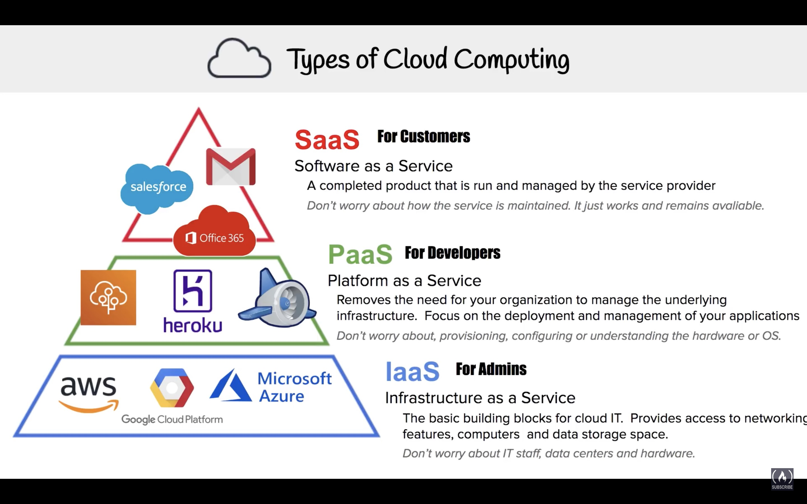

# AWS - CCP  CLF-C01

The course is all about video links and notes regarding the **AWS CCP Certification - Certified Cloud Practitioner** aka **CLF-C01** exam

- [Taking AWS Online from my home](https://aws.amazon.com/blogs/apn/now-you-can-take-the-aws-certified-cloud-practitioner-exam-at-your-home-or-office-24-7/)
- Access Code: `796-726-541 `
- Candidate ID: `AWS01801477`

## Important Links

- [Udemy Course](https://www.udemy.com/course/aws-serverless-a-complete-introduction/learn/lecture/7214768#overview)
- [Youtube Video - Introduction](https://www.youtube.com/watch?v=ubCNZRNjhyo&feature=youtu.be)
- [AWS - During Testing](https://aws.amazon.com/certification/policies/during-testing/)
- [AWS - Mind map on MIRO](https://miro.com/app/board/o9J_kl0gapY=/)
- [AWS - MIRO](https://miro.com/app/board/o9J_kkSKkJM=/)
- [AWS - Certification Link](https://www.aws.training/)
- [DigitalCloud Training](https://digitalcloud.training/aws-certified-cloud-practitioner-practice-tests/)
- [Freecodecamp - AWS CCP Certification](https://www.youtube.com/watch?v=3hLmDS179YE&t=2s)
- [AWS - Mock Question Video Youtube](https://www.youtube.com/watch?v=FXKE1SfityA&list=PL8lrfONBlapn3hLYC54Gorw1wt2yWC0l0&index=2)

# INSCALE - Topdanmark AWS Related Links

- [ICE Training Channel](https://teams.microsoft.com/l/channel/19%3a02e4eb66aef1414497c3d845068e87e6%40thread.skype/ICE%20Training?groupId=e979ba4c-4c26-401d-869b-c48901dad3ea&tenantId=d8986036-5135-44ac-b219-a64ab43409d5)

## Miro Link - Mindmap

- https://miro.com/app/board/o9J_kkSKkJM=/ 

## Recording video

- https://web.microsoftstream.com/video/53929061-a74d-4a53-aa8b-6526bc8dd20f?st=1
- https://web.microsoftstream.com/video/ee3d8aa2-16a7-42f8-9888-90deef489ce3
- https://web.microsoftstream.com/video/1b855f07-3977-4f6b-80f1-64e2fce4c038?st=3 


### AWS Certification Account

- [AWS Certification Website](https://www.aws.training/)
- **Username**: pramod.jingade@gmail.com
- **Password**: `zuko2352`
- Course Links
  - [AWS Cloud Practitioner Essentials (Second Edition)](https://www.aws.training/Details/Curriculum?transcriptid=E4hlkkgJSEil4GN1VENzog2&id=27076#modules)

>  NOTE: *Online AWS Course presented by "Kirstin Duplat"*

## Course Objectives

In this course, you will learn how to:

- Define what the cloud is and how it works
- Differentiate between cloud computing and deployment models
- Describe the AWS Cloud value proposition
- Describe the basic global infrastructure of the cloud
- Compare the different methods of interacting with AWS
- Describe and differentiate between AWS service domains
- Describe the Well-Architected Framework
- Describe basic AWS Cloud architectural principles
- Explain the Shared Responsibility model
- Describe security services with the AWS cloud
- Define the billing, account management, and pricing models for the AWS platform

## About CCP

- Costs: ~$100 USD

- Duration: 90 minutes

- Questions: 65 Questions

  - Multiple choice - radio buttons
  - Multiple reasons - checkbox

- Passing Score: 70%

- Validity: Valid for 3 years


### During Proctored Examination

- The Examiner will ask you to rotate your laptop / camera 360 degrees
- Wearing Smart watches not allowed
- Examiner might request to show hands

### Who is the CCP for ?

- Learning AWS foundational knowledge
- Shows you've poked around & can use the AWS console
- :red_circle: Focuses on billing & business-centric concepts
- Commonly obtained by sales & management to help inform VP & CEOs reasons to utilize AWS.

### CONS - What value does CCP hold ?

- Not a gilded title
- Can help superficially increase your **AWS Certification** count
- [NOT recognised as an important certification for developers on their resumés](https://youtu.be/3hLmDS179YE?t=119)

### PROS - What value does CCP hold ?

- CCP builds confidence for future exams
- It's an easy win & a confidence booster
- To become familiar with your test center
- Mitigate unknown conditions that can cause stress or distractions for future exam
- DIRECTLY prepare for [AWS Solution Architect Associate](https://aws.amazon.com/certification/certified-solutions-architect-associate/)

### CCP Exam Guide Outliner

- Cloud Concepts : 28%
- Security: 24%
- Technology: 36%
- Billing & Pricing: 12%

## Introduction

### Scalability in Cloud Computing

In cloud computing the term - _Scalability_ means the ability to resize your resources as necessary

By using **AWS Cloud Formation**, you have access to consistent, template based environment for development, test & production. 

### 3 factors to influence agility

The 3 main factors that influence agility are:

-  Increasing speed
- Ease of experimentation
- Cultivating a culture of innovation

### Elasticity in Cloud Computing

Elasticity is the power to scale computing resources up or down easily. Because AWS cloud compute elastic, it can auto-scale easily

### How you reduce scurity risks ?

Test often, Patch quickly & respond to incidents at Lightning speeds

### Reliability

Ability of a system to recover from Infrastructure or Service failures. In CC, reliability means to demand & mitigate service disruptions. 

- Must have well-planned foundations
- Reducing uncertainty to forecast system needs
- AWS regions, called Availability Zones - isolated location across demographics
- Fault tolerance - System can remain operational even if some of the components of the system fail
- High availability - Always functioning and available, minimum downtime

### Security of Cloud Computing

- Customers are in complete control & ownership of their data, which includes
  - which region to store data in
  - how encryption is handled
  - who holds the encrypted keys
  - monitor IT resources continually


## Module 01 - AWS Management Interfaces

Explore convenient options of accessing & using AWS resources

AWS Users can create & manage resources in 3 unique ways

- AWS Management Console (includes Mobile App) - **Console**
- AWS Command Line Interface - AWS **CLI**
- AWS Software Development Kits - AWS **SDK**

| AWS Management Console         | AWS Command Line Interface    | AWS Software Development Kit                |
| ------------------------------ | ----------------------------- | ------------------------------------------- |
| Navigation                     | Programming Language agnostic | Ability to use AWS in existing applications |
| Usability                      | Flexibility to create scripts |                                             |
| Mobile app (for iOS & Android) |                               |                                             |

### Knowledge Check

1. _Which of the following terms refers to - the power to scale computing resources up or down easily?_
   1. Elasticity ✅

## Module 02 - AWS Management Interfaces

### 01 - EC2 - Elastic Compute Cloud

AWS EC2 **Instances** are used to spin up servers which can be accessed via Security protocols like - SSH, TCP, HTTP

In AWS compute is consumed through the **Elastic Compute Cloud (EC2)** which is a web service from which you can launch "instances" which are essentially VMs running on the AWS KVM (Kernel based Virtual Machine) hypervisor.

- pay as you go
- a broad selection of Hardware & Software
- available across global locations

- Software - Amazon Machine Image **AMI**
- Network - Amazon Virtual Private Cloud **VPC**

### 02 - EBS - Elastic Block Store

Most EC2 instance types use the **Elastic Block Store (EBS)** for persistent storage. 
EBS volumes are durable, block-level storage volumes that can be attached to a single EC2 instance. 

There are a several different volume types available that differ in performance characteristics and price. These include: 

- General Purpose SSD (gp2)
- Provisioned IOPS SSD (io1)
- Throughput Optimized HDD (st1)
- Cold HDD (sc1)
- Magnetic (standard, a previous-generation type)

Each EBS volume is replicated across multiple systems within an Availability Zone (described below) to avoid the risk of data loss if a single hardware component fails. Additionally, users can take **snapshots** of their EBS volumes which are a point-in-time copy of the data.

Snapshots are incremental backups, which means that only the blocks on the device that have changed after your most recent snapshot are saved.

to attach and mount an EBS storage to an EC2 instance 

```bash
# list block storages
lsblk
# mount
sudo mount /dev/xvdb /mnt
```

### 03 - ELB - Elastic Load Balancer

Puts a load balancer in front of instances

- Decouples Domain Configuration from Instances
- Manage incoming traffic
- Handle downtime
- Easy to switch between instances

There are 3 types of ELBs

- **Application Load Balancer** - HTTP, HTTPS
- **Network Load Balancer** - TCP, UDP, SSH
- **Classic Load Balancer**

## Domain 01 - Cloud Computing

- [Youtube Link - Freecodecamp](https://youtu.be/3hLmDS179YE?t=469)

### Objectives

By the end of this lesson you should

- Define AWS cloud & its value proposition
- Identify different aspects of AWS cloud economics
- List the different cloud architecture design principles

### What is Cloud Computing ?

- The practice of using a network of remote servers hosted on the Internet to store, manage & process data, rather than a local server or a personal computer.

- Online delivery of IT Solutions & IT Infrastructure over the internet
  - Scalability
  - Low Cost
  - Reduce Risks
  - Reliable Coverage during disaster
  - Secure data
  - Less time focusing on Infrastructure (Automation)
  - 24/7 availability
  - Auto scaling or elastic

| On-premise                      | cloud providers                                              |
| ------------------------------- | ------------------------------------------------------------ |
| You own the servers             | Someone else owns the servers                                |
| You hire the IT people          | Someone else hires the IT people                             |
| You pay or rent the real-estate | Someone else pays or rents the real-estate (called Data-centres) |
| You take all the risk           | You are only responsible for configuring cloud services & code, someone else takes care of the rest |

### Advantages of Cloud Computing

- [6 Advantages of Cloud Computing](https://youtu.be/3hLmDS179YE?t=735)

1. *Trade capital expense for variable expense*
2. *Benefit from massive economies of scale*
3. *Stop guessing the capacity*
4. *Increase speed & agility*
5. *Stop spending money on running & maintaining data centers
6. *Go global in minutes*

### Types of Cloud Computing



### Cloud Computing - Deployment Models

- **Cloud** - Services fully available on cloud - Eg: Twilio, Dropbox, Squarespace :slightly_smiling_face:
  - Extremely low-cost compared to the other two
  - For Startup companies
  - Geographically available based on zones/regions
- **Hybrid** - Using both cloud & on-premise - Eg: Frozen Mountain :slightly_smiling_face:
  - Ability to deploy on customer location / host online
  - Flexible
  - Eg: Insurance companies
- **On-Premise** - Deploying resources on-premise of the vendor / customer - Eg: Philips :smile: 
  - Regulations
  - Private IP
  - Firewall restrictions
  - Public Sector
  - Super sensitive data
  - Eg: Government, Medical Hospitals

# Question & Answers

### Question 01

_Which feature of AWS allows an international company to provide **low latency** applications for its customers around the world ?_

- Elasticity :x:
- Fault Tolerance :x:
- High availability :x::
- Global Reach ✅

### Question 02

_Which AWS characteristic describes the ability to acquire resources as you need them & release resources when you don't need them ?_

- High Availability :x:
- Agility :x:
- Elasticity ✅
- Durability :x:

### Question 03

_What are the benefits of using Amazon EC2 instances compared to physical servers in your infrastructure (select two) ?_

- The ability to have different storage requirements ✅

- Pay only for the capacity you use ✅

- Automated Backups :x:

- Resizable :x:

- The ability to hot-add additional RAM :x:

### Question 04

_Which of the following 2 are AWS Database Service (choose two)_

- Amazon RDS :white_check_mark:
- Amazon Route 53 :x:
- Amazon S3 :x:
- Amazon RedShift :white_check_mark:

### Question 05

_Which type of EBS volume would you recommend for a high-performance application that is particularly sensitive to high latency?_

- General Purpose SSD (gp2) :x:
- EBS Provisioned IOPS SSD (io1) :white_check_mark:
- Throughput Optimized HDD (st1) :x:
- Cold HDD (sc1) :x:
- Magnetic (standard, a previous-generation type) :x:

#### Explanation

- IO1 is backed by solid-state drives (SSDs) and is the highest performance EBS storage option designed for critical, I/O intensive database and application workloads, as well as throughput-intensive database and data warehouse workloads, such as HBase, Vertica, and Cassandra. These volumes are ideal for both IOPS-intensive and throughput-intensive workloads that require extremely low latency.

- The answer “EBS General Purpose SSD (gp2) is incorrect and ideally suited to non-intensive workloads.

- The answer “EBS Throughput Optimized HSS (st1) is incorrect as there is no such.


### Question 06

_Which of the following describes a benefit of cloud computing that relates to its ability to scale out and scale in resources based on demand?_

- CAPEX :x:
- Elasticity :white_check_mark:
- Rapid Expansion :x:

- High Availability :x:

#### Explanation

- In cloud computing, elasticity is defined as "the degree to which a system is able to adapt to workload changes by provisioning and de-provisioning resources in an autonomic manner, such that at each point in time the available resources match the current demand as closely as possible".

- The answer “High Availability” is incorrect. Although a benefit of Cloud Computing it does not relate to this specific question.

- The answer “Rapid Expansion” is incorrect. Although by using Cloud Computing you can rapidly expand your technology stack, it does not demonstrate how you can scale out and scale in based on demand.

- The answer “CAPEX” is incorrect. Although a benefit of cloud computing it relates more to the fact that you can leverage cloud resources on a pay as you go model and thus invest in IT using an OPEX strategy rather than CAPEX.


### Question 07

_Which Amazon S3 Storage Class enables you to optimize costs by automatically moving data to the most cost-effective access tier, while ensuring that frequently access data is made available immediately?_

- Amazon Glacier :x:
- Amazon S3 Standard :x:
- Amazon S3 One-Zone IA :x:
- Amazon S3 Intelligent Training :white_check_mark:

#### Explanation

- The S3 Intelligent-Tiering storage class is designed to optimize costs by automatically moving data to the most cost-effective access tier, without performance impact or operational overhead. It works by storing objects in two access tiers: one tier that is optimized for frequent access and another lower-cost tier that is optimized for infrequent access. For a small monthly monitoring and automation fee per object, Amazon S3 monitors access patterns of the objects in S3 Intelligent-Tiering and moves the ones that have not been accessed for 30 consecutive days to the infrequent access tier. If an object in the infrequent access tier is accessed, it is automatically moved back to the frequent access tier.

- The answer “S3 Standard” is incorrect as it does not ensure cost-efficiency to your data

- The answer “S3 One-Zone IA” is incorrect. While it is cheaper than S3 Standard, it does not ensure automatically moving data to the most cost-effective storage when not required and then moving back to a storage class that makes the data rapidly accessible.

- The answer “Amazon Glacier” is incorrect as while it is the cheapest available on the platform, it does not offer the ability to make data instantly available when required. Retrieving data from Glacier can take a bit of time depending on the retrieval option.


### Question 08

_Which of the following AWS services enables you to quickly launch a webserver with a pre-configured WordPress installation pack, offers predictable monthly pricing, comes with integrated certificate management, and provides free SSL/TLS certificates?_

- AWS Elastic Beanstalk :x:
- AWS EC2 :x:
- AWS Lightsail :white_check_mark:
- AWS RDS :x:

#### Explanation

- AWS LightSail offers virtual servers that are easy to set up and manage. AWS LightSail servers offer preconfigured virtual specifications for your servers, with predictable pricing strategy. You can launch your website, web application, or project in minutes, and manage your instance from the intuitive LightSail console or API. Applications like WordPress can be launched preconfigured making it very easy to provision a website within minutes and where you do not need the complexity associated with manually configuring an EC2 server such as storage, load balancing, and certificate management.

- LightSail also offers free SSL/TLS certificates that can be provisioned and added to a load balancer in just a few clicks.

- The answer, ‘AWS EC2’, is incorrect because EC2 offers much for configuration options and individual components such as configuring a server with WordPress and other web applications have to be managed separately or via scripts. Furthermore, you will need to configure your own Elastic Load Balancers and install SSL Certs, etc.

- As your requirements become more complex, you can easily upgrade your LightSail environment and move to EC2 with a simple, guided experience.

- The answer, ‘AWS RDS’ is incorrect because AWS RDS is a managed database solution and not a virtual server solution to host websites and applications like WordPress

- The answer, ‘Elastic Beanstalk’ is incorrect as it is a platform service enabling you to automatically provision an entire infrastructure environment to support application code that you can upload.

- Ref: https://aws.amazon.com/lightsail/features/


### Question 09

_Which of the following services offered by AWS are considered global services? (Choose 2 answers)_

-  Route53 :white_check_mark:
- Amazon RDS :x:
- Express Route :x:
- Elastic Compute Cloud (EC2) :x:
- Identity and Access Management (IAM) :white_check_mark:

#### Explanation

Amazon Identity and Access Management (IAM) is a global identity service. You do not need to select a specific region to create IAM Users, Groups, or Roles as these entities are defined globally in your AWS Account and thus are unique throughout the globe.

Similarly, Route53 is a global DNS and Routing service enabling you to define global DNS records for your application and help you build highly available, fault-tolerant, and business-specific traffic routing solutions for your applications.

EC2 and Amazon RDS are both regional services and you need to define the region you want to deploy these services in and so these are incorrect answers.

Express Route is an incorrect answer because this is a Microsoft product and nothing to do with AWS.

