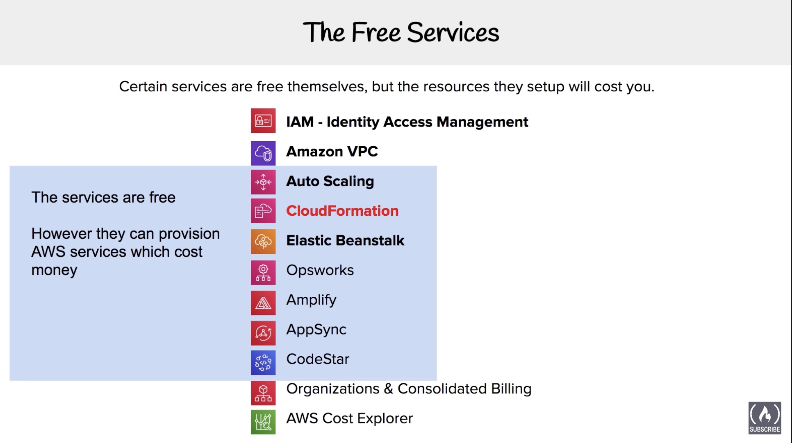
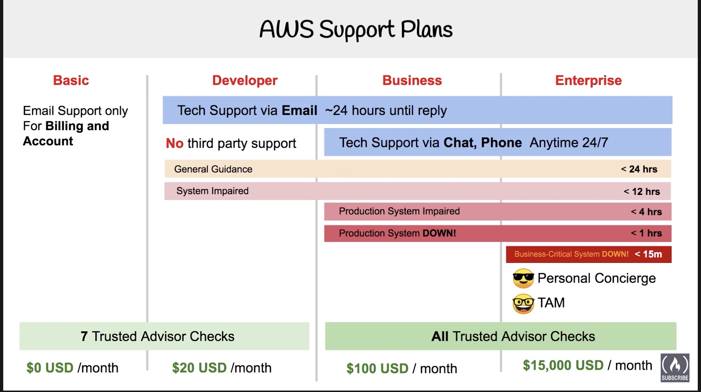

# Acronyms & Full forms

| Acronym               | Description                                                  |
| --------------------- | ------------------------------------------------------------ |
| CloudFront            | Amazon **Cloud Front** services enable caching of content at the nearest Edge Locations for fast distribution to customers. |
| CFN - Cloud Formation | Models & provisions a collection of related AWS resources & 3rd party resources so you can launch & configure them together as a stack. Uses Infrastructure as code. supports **JSON** or **YAML** format. |
| AWS                   | Amazon Web Service                                           |
| AVM                   | Amazon Vending Machine - uses Service Catalogue template to setup Multi-accounts |
| AMI                   | Amazon Machine Image - Save a copy of your server            |
| IoT                   | Internet of Things                                           |
| RI                    | Reserved Instances                                           |
| SSD                   | Solid State Device                                           |
| AZ(s)                 | Availability Zones                                           |
| SNS                   | Simple Notification Service                                  |
| SES                   | Simple Email Service                                         |
| SQS                   | Simple Queue Service                                         |
| DDoS                  | Distributed Denial of Service - AWS managed security protection |
| EC2                   | Elastic Compute Cloud                                        |
| ECS                   | Elastic Container Service                                    |
| ES                    | Elasticsearch                                                |
| EB                    | Elastic Beanstalk                                            |
| EBS                   | Elastic Block Storage                                        |
| EFS                   | Elastic File Storage                                         |
| EKS                   | Elastic **Kubernetes** Service                               |
| MKS                   | Managed **Kafka** Service                                    |
| KMS                   | Key Management Service                                       |
| EMR                   | Elastic Map Reduce                                           |
| S3                    | Simple Storage Service                                       |
| SWF                   | Simple Workflow Service                                      |
| SSM                   | Simple Systems Manager *(Roles assigned to developers)*      |
| TAM                   | Technical Account Manager                                    |
| VPC                   | Virtual Private Cloud                                        |
| VPN                   | Virtual Private Network                                      |
| IAM                   | Identity & Access Management                                 |
| IDS                   | Intrusion Detection Syst                                     |
| I                     | Intrusion Protecti                                           |
| MFA                   | Multi Factor Authentication                                  |
| RDS                   | Relational Database Service (PostgreSQL like DB)             |
| Amazon DynamoDB       | AWS Managed NoSQL Database                                   |
| Amazon DocumentDB     | MongoDB compatibility AWS managed Database                   |
| Amazon Redshift       | Fast, simple, cost-effective data warehousing                |
| ASG                   | Auto Scaling Group - Group multiple servers                  |
| ELB                   | Elastic Load Balancer - puts a load balancer infront of the instances. |
| ALB                   | Application Load Balancer                                    |
| NLB                   | Network Load Balancer                                        |
| Web ACL               | Web Access Control List                                      |
| NACL                  | Network Access Control List                                  |
| IGW                   | Internet Gateway - Enables access to the internet            |
| AWS WAF               | **Web application firewall** (**WAF**) A **web application firewall** (**WAF**) helps protect your web applications from common web exploits that could affect application availability, compromise security, or consume excessive resources. |
| MQ                    | Amazon ActiveMQ                                              |
| TCO                   | Total Cost of Ownership                                      |


# AWS Global Infrastructure

## Features

- 69 Availability zones
- 22 Geographic regions
- More Edge locations than AZs
- Low latency
- High Availability
- **Regions** - Physical location in the world with multiple **Availability Zones (AZ)**
- **Availability Zones (AZ)** - one or more discrete data-centres
- **Edge Locations** - data-centre owned by a trusted partner of AWS

## Regions

:exclamation: A **geographically distinct** location which has multiple data-centres (AZs)

- Each region has atleast **2 Availability Zones (AZs)**
- Every **region** is **physically isolated** & **independent** to every other region in terms of - location, power, water supply
- :exclamation:AWS largest region is **US-EAST** (ie., North Virginia)
- :exclamation:Services almost always available first in **US-EAST**
- Not all services are available in all regions
- :exclamation:**US-EAST-1** is the region where you see all your billing information
- 5 new regions - under progress

- [AWS regional Endpoints](https://docs.aws.amazon.com/general/latest/gr/rande.html)
- [3D world Model - AWS Regions](https://www.infrastructure.aws/)

## Availability Zones (AZs)

:exclamation: An AZ is a datacenter owned & operated by AWS in which their services run

- Each region has atleast **2 Availability Zones (AZs)**
- :exclamation: AZs are represented by a Region Code, followed by a letter identifier

```bash
# a - availability zone 'a'
us-east-1a 
# North Virginia has 6 Availability Zones
us-east-1a
us-east-1b
us-east-1c
us-east-1d
us-east-1e
us-east-1f
```

- **Multi-AZ:** Distributing your instances across multiple AZs allows failover configuration for handling requests when one goes down
- <10ms latency between AZz in a region

## Edge Locations

An Edge location is a datacenter owned by a **partner trusted by AWS** which has a direct connection to the AWS network.

- :exclamation:These locations serve requests for **CloudFront** & **Route 53**.
- Requests going to these services will be routed to the nearest edge location automatically
- :exclamation:**S3 Transfer Acceleration** & **API Gateway** endpoint traffic also use the AWS Edge Network
- This allows for **Low latency** no matter where the end user is geographically situated

## GovCloud (US)

AWS GovCloud Regions allow customers to host sensitive **Controlled Unclassified Information** & other types of regulated workloads.

>  *Useful If you want to build something to a Government or Government related industry.*

- :exclamation:**Only** operated by employees who are U.S citizens, on U.S soil
- :exclamation:**Only** accessible to U.S entities & root account holders who pass a screening test
- Customers can architect secure cloud solutions which comply with
  - FedRAMP High baseline
  - DOJ's Criminal Justice Information Systems (CJIS) Security policy
  - U.S International Traffic in Arms Regulations (ITAR)
  - Export Administration Regulations (EAR)
  - Department of Defence (DoD) Cloud computing security requirements guide

# Getting Started

> :exclamation:You cannot use AWS services without Credit Card

## Billing Preferences, Budgets & Alarms

- Billing Metrics always exist in **us-east-1**
- You need to select **CloudWatch** service for billing alarms
- You get 10 free alarms as part of your basic account
- **SNS** - *Simple Notification Service* - Basic Email Alert

## Change IAM Users Sign-in Link

### Customize Account Alias

:exclamation: This is an important security step when you first setup your account

> Generally you should not always use your root account to login and setup AWS services. Also you should not share your root account credentials with developers

- [Youtube Link - Change IAM Users sign-in link](https://youtu.be/3hLmDS179YE?t=2420)

- In the Dashboard page, search for -  **IAM**
- Click **customise** for - *IAM users sign-in link*
- Provide an **Account alias** - `raysiti-aws`

### Activate MFA on Root Account

The **Multi-Factor Authentication** **(MFA)** on your AWS root account adds another layer of protection to keep your account secure.

There are 3 different types of MFA device that you can assign to your root account - 

- :white_check_mark: **Virtual MFA device** - An Authenticator App installed on your mobile or computer.
  - Select **Google Authenticator** - which reads QR code to authenticate
  - Scan the QR code with your mobile using the **Google Authenticator** app.
  - It provides to **MFA numbers** that you need to enter
- **U2F security key** - Yubikey
- **Other hardware MFA device** - Gemaito token

### Create Individual IAM user accounts

- Select the Accordian - Click on **Manage Users**
- Follow the - [steps to create a new User](https://www.youtube.com/watch?v=3hLmDS179YE&t=2419s)

### Setup a Password Policy

- Select the Accordian - Click on Setup a Password policy
- Follow the instructions provided - [in the link](https://youtu.be/3hLmDS179YE?t=2926)

# Pricing Models

There are 4 models of payment when it comes to using AWS services

1. **On-Demand** **Instances** - Least Commitment

   When you launch an EC-2 instance, it is by default On-Demand pricing.

   1. :exclamation: *no upfront payment*
   2. :exclamation: *no long-term commitment*
   3. *low cost & flexible*
   4. *only pay per hour*
   5. *perfect for short-term, spiky, unpredictable loads*
   6. *cannot be interrupted*
   7. *for first-time apps*

2. **Reserved Instances - RI** - upto 75% off

   1. _steady state or predictable state_
   2. _commit to EC2 over 1 or 3 year term_
   3. _can resell unused reserved instances_

3. **Spot Instances** - upto 90% savings

   1. *request space computing capacity*
   2. *flexible start & end dates*
   3. *can handle interruptions (server randomly stopping & starting)*
   4. _For non critical background jobs_

   

4. **Dedicated Host Instances**  - Most expensive

   1. _you get Dedicated servers_
   2. _can be on-demand or reserved (upto 70% off)_
   3. _when you need a guarantee of isolated hardware_
   4. _for enterprise requirements_

## 1. On Demand Instances / Pricing

:exclamation: Least Commitment

When you first start / create an EC2 instance, it is by default on, **On-Demand**

## 2. Reserved Instances / Pricing - RI

:exclamation: Best Long term value

These type of instances are designed for applications that have a steady-state, predictable usage or require "reserved capacity".
$$
reduced \ \ pricing = term * class \ offering * payment \ option
$$

- ***Class Offering*** - Standard, Convertible, Scheduled
- ***Term*** - You commit to a 1 year or 3 year contract. Longer the term, greater savings
- ***Payment options*** - All, Partial or No - upfront payment

1. Reserved Instances can be shared between multiple accounts within the organization
2. Unusued RI can be sold in **Reserved Instance Marketplace**.

## 3. Spot Instances - SI

:exclamation: upto 90% off (when it comes to savings) but can be interrupted

AWS has **unused compute capacity** that they want to utilise the max capacity of their idle servers. So they came up with **Spot Instances**

- These instance provide the most savings - upto 90% compared to **On-Demand** Pricing.
- Can be interrupted / terminated
- These instances **can be terminated** if the ***compute capacity is needed by on-demand customers***
- **AWS Batch** is an easy & convenient way to use **Spot-Pricing**
- Useful for **Load-balancing** servers, Starting / Stopping, testing, can be spun up and stopped.
- If AWS terminate your instances, you wont be charged for the partial hours that you used.
- But if You terminated these Spot-instances, you will be charged for the number of hours they were used.

## 4. Dedicated Host Instances

:exclamation: Most expensive pricing

- Designed to meet regulatory requirements
- When you have strict **server-bound license** that won't support multi-tenancy or cloud deployments
- Perfect for Enterprise or Large Organizations
- Enterprises / Large Organizations may have security concerns or obligations against sharing the same hardware with other AWS customers
- Comes in 2 flavours -  both Reserved & On-Demand (70% off on-demand pricing)

| Multi tenant                                                 | Single Tenant                                                |
| ------------------------------------------------------------ | ------------------------------------------------------------ |
| Multiple customers are running workloads on the same hardware | Single customer has been dedicated to the hardware           |
| Virtual Isolation separates these customers (like a virtual apartment) | Physical isolation is what separates customers (think individual housing) |
| Eg: On-Demand, Reserved, Spot instances                      | Eg: Dedicated VPC                                            |

# Billing & Pricing

This module talks about billing & pricing when it comes to using AWS services

## Free Services



- These services are free to use
- However they can provision other AWS services which can cost money

## AWS Support Plans

AWS offers 4 different support plans

- **Basic** 
  - $0 USD / month
  - Email support only
  - mainly for billing & account purposes.
  - 7 Trusted Advisor checks allowed
- **Developer** 
  - $20 USD / month
  - Tech Support via Email ~24 hours only. 
  - No 3rd party support (ie., no Application specific support)
  - 7 Trusted Advisor checks allowed
- **Business** 
  - $100 USD / month
  - 24/7 chat & phone support. 
  - Screensharing possible (includes Technical support)
  - All Trusted Advisor checks allowed
- **Enterprise** 
  - $15,000 USD / month
  - 2 dedicated resources.
  - Personal Concierge, TAM (Technical Account Manager)
  - All Trusted Advisor checks allowed



## AWS Marketplace

AWS Marketplace is a curated digitally catalogue with 1000 of software listings from independent software vendors.

You can also search AWS marketplace under the context of a AWS service (for eg: EC2 service)

- Easily find, buy, test software that runs on AWS servers.
- Contains Products that are free to use / have an associated charge.
- The sales channel of ISV & Consulting partners allows you to sell your solutions to other customers.
- Has 1,361 (approx) vendors
- To see a list of Subscribed services :arrow_right: :a: AWS Marketplace subscription 

Products can be offered up as follows:

- Amazon Machine Images (AMIs)
- AWS cloudformation templates
- Software as a service (SAAS) offerings
- Web ACL
- AWS WAF rules

### What Is an Web ACL - Access Control List ?

An access control list (ACL) contains rules that grant or deny access to certain digital environments. There are two types of ACLs:

- **Filesystem ACLs: **filter access to files and/or directories. Filesystem ACLs tell operating systems which users can access the system, and what privileges the users are allowed.
- **Networking ACLs: **filter access to the network. Networking ACLs tell routers and switches which type of traffic can access the network, and which activity is allowed.

## AWS Trusted Advisor

This service advices you on security, saving money, performance, service limits & fault tolerance.

- Think of it as an automated checklist of AWS best practices
- On Free tiers you get 7 Trusted Advisor checks
- On Business & Enterprise tier you get all Trusted Advisor checks

This checklist can be grouped into 5 categories

-  :exclamation:**Cost optimization**
  - Idle Load Balancers (free)
  - Unassociated Elastic IP addresses (free)
- **Performance**
  - High Utilization Amazon EC2 instance (free)
- :exclamation: **Security**
  - MFA on Root account (free)
  - IAM access key rotation (free)
- **Fault** **Tolerance**
  - Amazon RDS Backups (free)
- **Service Limits**
  - VPC (free)

## Consolidated Billing

This is a feature turned on by default when there is a Multiple member account.

- All billing charges are sent to the Master account
- Consolidates your billing & payment methods across multiple AWS accounts into one bill
- For Billing - AWS treats all accounts UNDER one organization as if they were one account
- This service is free of cost
- use **Cost explorer** to visualize your consolidated billing

### Volume Discounts

- AWS has volume discounts for many services

- The more you use, the more you save

- Consolidated Billing lets you take advantage of Volume discounts

  | Data Transfer | Price        |
  | ------------- | ------------ |
  | First 10 TB   | $0.17 per GB |
  | Next 40 TB    | $0.13 per GB |

## AWS Cost Explorer

Allows you to **visualize**, **understand** & **manage** your AWS costs & usages over time.

- Default reports - Cost driver & Usage trends
- Use forcasting to get ideas on future workload & costs
- Visualize - daily or monthly level

## AWS Cost and Usage Report

Generate a detail spreadsheet to help you analyse & understand your AWS costs

- Places reports on S3 bucket
- Uses Athena to generate the report
- Use QuickSight to generate graphs

## AWS Budgets

Think of AWS Budgets as - *billing alarms on steriods*!

AWS Budgets allow you to setup alerts if you are nearing / exceeding your defined budgets.

- Create Cost, Usage & Reservation budgets
- First 2 budgets are free of charge
- When you use AWS Budgets - Each budget is $0.02 per day  OR ~ $0.60 USD / month
- 20,000 budget limit 
- Plan your service usage, service costs & instance reservations
- Track - monthly, quarterly or yearly levels
- Get notified via - Email, Chatbot

## TCO Calculator

TCO Calculator stands for - Total Cost of Ownership Calculator

It estimates HOW MUCH YOU WOULD SAVE when moving from on-premise to AWS cloud.

- Generates detailed set of reports for presentation
- Built on underlying calculation which generate fair assessment of value
- Helps by reducing the need to invest on large capital expenditures
- The tool is for approximation purposes only!

## AWS Landing Zones

Helps "Enterprise" level users quickly setup a secure, AWS multi-account architecture.

- Very expensive upfront cost
- Provides you with a baseline environment to get started with multi-account architecture
- Uses **Amazon Vending Machine (AVM)** which uses a **Service Catalogue Template** for setting multi-accounts
- Automatically services login and Single Sign On for customers
- Implement account baselines using Landing Zone configuration and pipeline

## AWS Quickstarts

Prebuilt Templates by AWS & AWS Partners to help you deploy your popular stacks on AWS.

- Reduce hundreds of manual procedures into few simple steps
- Composed of 3 parts
  - Reference architecture for the deployment
  - AWS Cloudformation template which automate & configure the deployment
  - Deployment guide explaining the architecture & implementation in detail

## Resource Groups & Tagging

### Tags

Words or Phrases that act as metadata for organizing your AWS resources

### Resource Groups

Collection of AWS resources that share one or more tags. can display based on -

- Metrics
- Alarms
- Configuration Settings

While creating a Resource Group, you can create 2 types

- Tag Based
- Cloud Formation based

# Question & Answers


### Question 01

Which of the following statements are true ? (Choose two)

- Amazon **Cloud Front** services enable caching of content at the nearest Edge Locations for fast distribution to customers :white_check_mark:
- There are more Availability Zones than Edge Locations, & more Edge Locations than regions in the world :x:
- There are more Edge Locations than Availability Zones, & more Availability Zones then Regions in the world :white_check_mark:
- There are more Regions than Availability Zones, & more Availability Zones than Edge Locations in the world :x:


### Question 02

Which of the following is one of the design principles related to "**Reliability**" in cloud

- Protect data on transit & on rest :x:
- Automatically recover from failure :white_check_mark:
- Perform operations as code :x:
- Go global in minutes :x:


### Question 03

Which of the following is an - Amazon Domain Name System (DNS) web service ?

- Amazon Route 53 :white_check_mark:
- Amazon Lightsail :x:
- AWS Snowball :x:
- AWS Direct connect :x:


### Question 04

Which of the following statements are true ? (Choose two)

- "Enterprise" AWS support plan includes Infrastructure Event Management with additional fee :x:
- "Enterprise" AWS support plan includes Infrastructure Event Management without additional fee :white_check_mark:
- "Business" AWS support plan includes Infrastructure Event Management with additional fee :white_check_mark:
- "Business" AWS support plan does not include Infrastructure Event Management at all. :x:


### Question 05

Under AWS shared responsibility model, which of the following is the responsibility of AWS

- Firewall Configuration :x:
- Physical security of Infrastructure :white_check_mark:
- Patching guest operating systems :x:
- Security groups configuration :x:


### Question 06

Which of the following helps secure an AWS account

- Use Cloudwatch logs insight :x:
- Enable AWS Organizations :x:
- Activate Multi-Factor Authentication (MFA) :white_check_mark:
- Enable AWS config :x:

