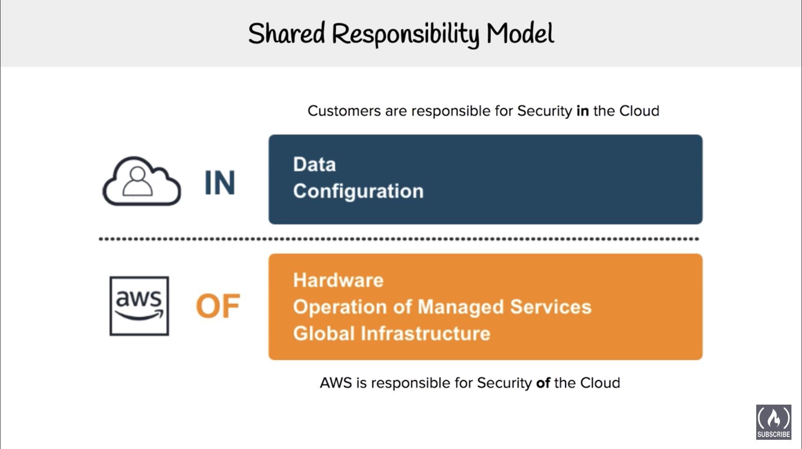
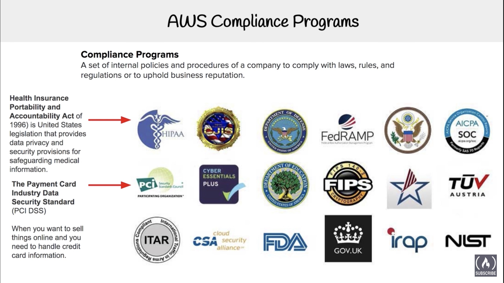
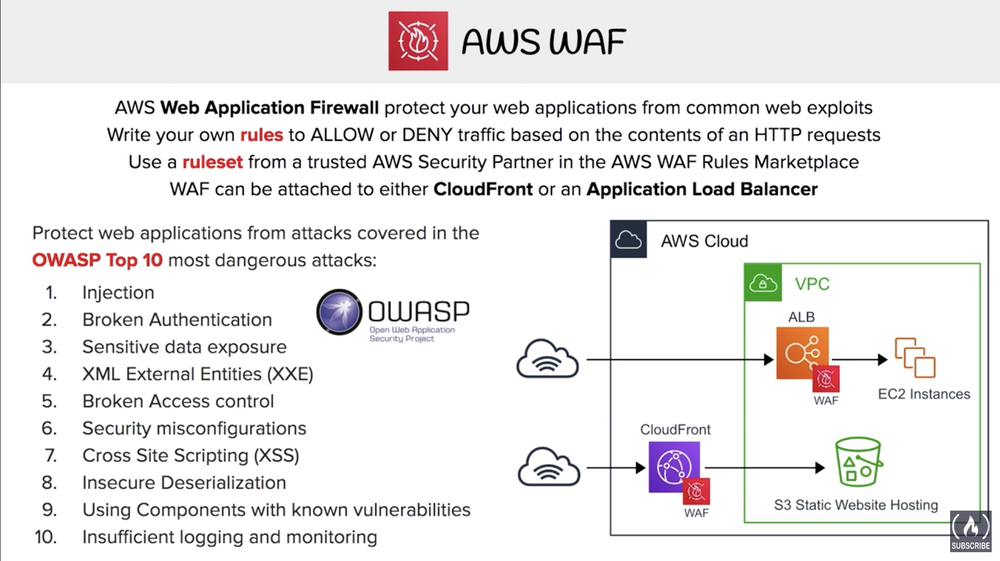
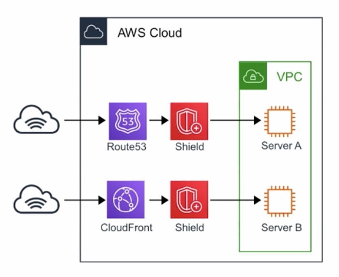
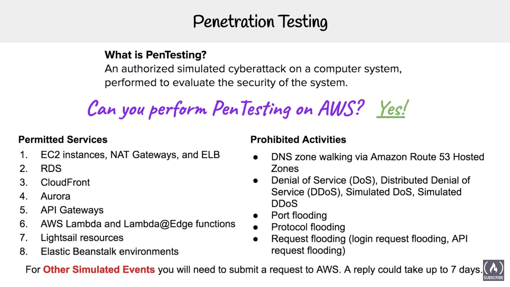
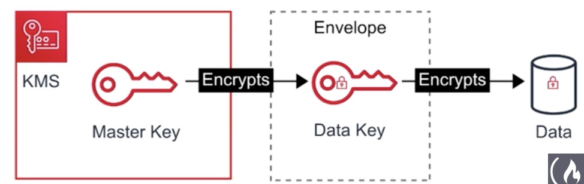
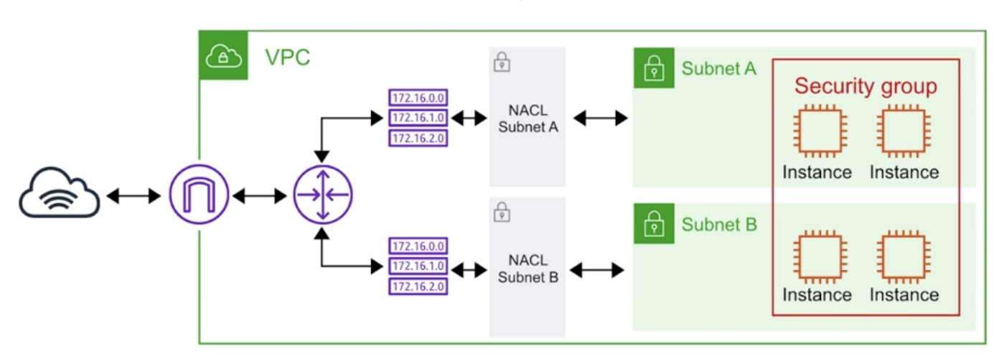

# Technology Overview

## Organizations & Accounts

### Organizations

Organizations allow you to centrally manage billing, compliance, control access, security & share resources across your AWS accounts.

- Billing
- Compliance
- Control Access
- Security
- Share resources

### Organization Units

Group of AWS account within an Organization which contain other organizations - creating an hierarchy.

### Root Account User

Its a single sign-in identity that has complete access to all services & resources in AWS account. Every account has a Root-account user.

### Service Control Policies

Gives central control over the allowed permission across all your AWS accounts in your organization, ensuring all your accounts stay within the organization's guidelines.

## AWS Networking

AWS Networking takes a recap of AWS Global Infrastructure (aws-ccp-02.md / aws-ccp-02.pdf)

| Name                        | Description                                                  |
| --------------------------- | ------------------------------------------------------------ |
| Region                      | Geographical Location of your network                        |
| AZ                          | Availability Zone - Data center of your AWS resources (us-east-1a) |
| VPC (Virtual Private Cloud) | Logically isolated section in your AWS cloud where you can launch AWS resources |
| Internet Gateway (IGW)      | Enables access to the internet                               |
| Route Tables                | Determine network traffic from where your subnets are redirected |
| NACLs                       | Network Access Control List - Acts as firewall :fire: at Subnet levels |
| Security Group              | Acts as firewall :fire: at Instance levels                   |
| Subnets                     | Logically partitioning of an IP Network, into smaller network segments (Eg: Public, Private subnet) |

### VPCs

Amazon Virtual Private Cloud (Amazon VPC) enables you to launch AWS resources into a virtual network that you've defined. This virtual network closely resembles a traditional network that you'd operate in your own data center, with the benefits of using the scalable infrastructure of AWS.

- *Amazon VPC is the networking layer for Amazon EC2.* 

You can create, access, and manage your VPCs using any of the following interfaces:

- **AWS Management Console** — Provides a web interface that you can use to access your VPCs.
- **AWS Command Line Interface (AWS CLI)** — Provides commands for a broad set of AWS services, including Amazon VPC, and is supported on Windows, Mac, and Linux, see [AWS Command Line Interface](https://aws.amazon.com/cli/).
- **AWS SDKs** — Provides language-specific APIs and takes care of many of the connection details, such as calculating signatures, handling request retries, and error handling, see [AWS SDKs](http://aws.amazon.com/tools/#SDKs).
- **Query API** — Provides low-level API actions that you call using HTTPS requests. Using the Query API is the most direct way to access Amazon VPC, see the [Amazon EC2 API Reference](https://docs.aws.amazon.com/AWSEC2/latest/APIReference/).

# AWS Services

## Database Services

The following is a list of 8 Database services offered by AWS -

| Database          | Description                                                  |
| ----------------- | ------------------------------------------------------------ |
| DynamoDB          | NoSQL key/value database (eg: **Cassandra / Firebase**)      |
| DocumentDB        | NoSQL Document database that is **MongoDB** compatible       |
| RDS               | Relational Database Service that supports multiple engines (Engines - **MySQL, PostgreSQL, Maria DB, Oracle, Microsoft SQL server, Aurora**) |
| Aurora            | **MySQL** (5x faster) & **PostgreSQL** (3x faster) database fully managed Relational Database - greater performance. Also more expensive. Enterprise level. |
| Aurora Serverless | Database that only runs when you need it - just like AWS Lambda services. Most in-expensive RDS |
| Neptune           | Managed Graph Database                                       |
| Redshift          | Columnar Database, Petabyte warehouse (1000 TB = 1 PB !!)    |
| Elasticache       | **Redis** or **Memcached** database. Used for Caching solutions. Open-source |

## Provisioning Services

| Services          | Description                                                  |
| ----------------- | ------------------------------------------------------------ |
| Elastic Beanstalk | AWS service for deploying & developing Web applications & services developed using Java, Node JS. Provides an easy installation wizard. (Heroku for AWS :smile:) |
| OpsWorks          | Configuration Management service that provides managed instances of **Chef** & **Puppet** |
| Cloud Formation   | Infrastructure as Code, JSON or YAML                         |
| AWS QuickStart    | pre-made packages that can launch & configure your AWS compute, network, storage & other services required to deploy a workload on AWS |
| AWS Marketplace   | Digital catalogue of **thousands** of AWS listings - from independent software vendors that you can - find, buy, test & deploy software |

## Computing Services

The following is a list of Computing services offered by AWS

| Instances         | Description                                                  |
| ----------------- | ------------------------------------------------------------ |
| EC2               | Elastic Cloud Compute - Highly configurable server. consists of CPU, Memory, Network & Operating system. |
| ECS               | Elastic Container Service - Imagine ***Docker as a Service*** - A Highly scalable, high-performance, container orchestration service that supports Docker containers, pay for EC2 instances. |
| Fargate           | Microservices where you dont think about the infrastructure. Play per task. It's an evolution of ECS. |
| EKS               | Elastic Kubernetes Service - Imagine ***Kubernetes as a Service*** - easy to deploy, manage & scale containerized applications using Kubernetes. |
| Lambda            | Lambda Serverless Functions, run code without provisioning or managing servers. You pay only for the compute time you consume |
| Elastic Beanstalk | orchestrates various other AWS services including, EC2, S3, SNS, Cloudwatch, Autoscaling & Elastic Load Balancers |
| AWS Batch         | plans, schedules & executes your batch computing workloads across the full range of AWS compute services, such as - EC2 & Spot instances. |

## Storage Services

The following is a list of  services offered by AWS related to Storage & data access.

| Storage         | Description                                                  |
| --------------- | ------------------------------------------------------------ |
| S3              | Simple Storage Service - File system storage service provided by AWS (logical partition storage) |
| S3 Glacier      | Low-cost storage for archiving & long-term backup            |
| Storage Gateway | Hybrid Cloud storage with local caching 1. File gateway, 2. Volume gateway 3. Tape Gateway. Extension of on-prem storage to cloud. |
| EBS             | Elastic Block Storage - Unlike S3, it consists of virtual Hard-drives that you attach to your EC2 instances for storage. Only attach to one EC2 instance per EBS. |
| EFS             | Elastic File Storage - File storage solution, mountable to multiple EC2 instances at the same time. |
| Snowball        | Physically migrate alot of data via a computer science - 50-80 TB |
| Snowball Edge   | A Better version of Snowball - ~100 TB                       |
| Snowmobile      | Shipping container, pulled by a Semi-trailer truck - 100 PB  |

## Business Centric Services

Consists of AWS Enterprise related services

| Name           | Description                                                  |
| -------------- | ------------------------------------------------------------ |
| Amazon Connect | Cloud based call center service, you can set it up in few clicks. Record, inbound calls. Setup call workflows. |
| WorkSpaces     | Virtual Remote Desktop - AWS service for provisioning either Windows or Linus OS. scalable upto 1000 desktops |
| WorkDocs       | A content creation & collaboration service - AWS version of Sharepoint - CRUD content |
| Chime          | AWS solution for Online Meetings, Video Conferencing, Business calling. Similar to Skype + Slack |
| WorkMail       | AWS service for managed Business emails. Online GMail for AWS. |
| Pinpoint       | Marketing Campaign Management system, send E-newletters,  Targetted emails, SMS, Push notifications. |
| SES            | Simple Email Service - Cloud based email service designed for marketters & application developers to send marketting, notifications & email. Supports HTML content emails unlike SNS which only sends simple unicode emails. |
| Quicksight     | A Business Intelligence BI service. Generate & share visualizations, charts. |

## Enterprise Integration

Enterprise Integration is all about "Going Hybrid".

- List of AWS services for bringing on-premise technologies over to cloud.

| Name             | Description                                                  |
| ---------------- | ------------------------------------------------------------ |
| Direct Connect   | dedicated Gigabyte network connection for your on-premise to AWS. |
| VPN              | Setup a secure Virtual Private Network connection from on-prem to AWS. Site to site (direct on-prem to AWS) or client VPN (from clients to AWS). |
| Storage Gateway  | AWS hybrid storage services allows your On-Premise applications to use AWS cloud storage. Useful for backup, archiving, disaster recovery. |
| Active Directory | AWS Directory Services for Microsoft Managed Active Directories. |

## Logging Services

List of AWS services for Logging & Monitoring purposes.

| Name                        | Description                                                  |
| --------------------------- | ------------------------------------------------------------ |
| CloudTrail                  | Logs all API calls between AWS services (_who is to blame for this EC2 spin up...?_) |
| CloudWatch                  | is a collection of multiple services for Logging purposes    |
| 1. CloudWatch **Logs**      | Performance data about AWS services. CPU Utilization, Memory, Network, Application Logs. Eg. Rails, Nginx, Lambda |
| 2. CloudWatch **Metrics**   | Represents a time-ordered set of data points. A variable to monitor |
| 3. CloudWatch **Events**    | Trigger an event based on a condition / situation - Exceeding Space - trigger email |
| 4. CloudWatch **Alarms**    | Trigger notifications based on metrics. You can specify a Threshold. |
| 5. CloudWatch **Dashboard** | Create visualizations based on metrics.                      |

# Security

## Shared Responsibility Model

The following diagrams show the shared responsibility model between a AWS customer & AWS management

### HighLevel Overview

### Detailed Overview

## AWS Compliance Programs

To get the full list of compliances that AWS service provides. Click the following link - [Compliance Programs Link](https://aws.amazon.com/compliance/programs/)

### Compliances Overview

## AWS Artifact

### _How do we know AWS meets compliance ?_

AWS "Artifact" is a service which provides compliance & security details -

- No cost, self-service portal
- On-demand access to AWS' compliance reports
- These checks are based on Global compliance frameworks

- Ability to report out - **PDF*** (Adobe Acrobat reader only), **XLSX**

## Amazon Inspector

### *How do we prove that a EC2 instance is harden ?*

> "**Hardening**" - The act of removing as many security risks as possible

- AWS Inspector runs a **security benchmark** against specific EC2 instances. You can run a varierty of security benchmarks.
- Can perform both Network & Host assessments
  - Install AWS agent on your EC2 instance
  - Run an assessment for your targets
  - Review findings & remedy security issues.

> One very popular benchmark you can run is CIS which as 699 checks!  CIS- Center for Internet Security

## AWS WAF - Web Application Firewall

## AWS Shield

AWS Shield is a managed DDos (Distributed Denial of Service) protection service that safeguards applications running on AWS

### _What is a DDoS attack ?_

A Malicious attempt to disrupt normal traffic by flooding a website with large amount of fake traffic.

- :exclamation: When you route your traffic using **AWS Route 53** or **CloudFront**, you are using AWS Shield standard.
- All AWS customers benefit from automatic protections of AWS shield standard, at no additional cost
- Protects you against Layer 3,4,7 attacks
  - 7 - Application layer
  - 4 - Transport layer
  - 3 - Network layer

## Penetration Testing

## Guard Duty

Amazon Service which protects resources using IDS & IPS

### _What is IDS / IPS_ ?

- Intrusion Detection System & Intrusion Protection System

- A Device or Software that monitors a network or systems for malicious activity or policy violation
- Guard duty is threat detection service
- Logs stored under Guard Duty :arrow_right: Findings

## Key Management Service

A managed service that makes it easy for you to create & control encrypted keys used to encrypt your data.

- KMS is a multi-tenant HSM (hardware security model)
- Encrypt your data with a simple checkbox
- KMS uses Envelope Encryption

### Envelope Encryption

When you encrypt your data key with a master key as an additional level of security

## Amazon Macie

Fully managed service that continuously monitors S3 data access activity for anomolies.

- Generates detailed alerts when it detects risks
- :exclamation: Uses Machine learning to analyze your CloudTrail logs
- Identifies your most risk users which leads to a compromise

## Security Groups & NACLs

The following shows important differences between Security Groups & NACLs

### Security Groups

- Act as :fire: firewall at **instance** level
- Implicitly denies all traffic
- You control the allow rules
- Eg: Allow EC2 access on port 22 for SSH

### NACLs

Network Access Control Lists

- Act as :fire: firewall at **subnet** level
- You create both allow & deny rules
- Cherry pick IP address to deny access to AWS resources
- Eg: Block a specific IP for access which might have been flagged for abuse

## Amazon VPN

Virtual Private Network lets you establish a secure & private tunnel from your network or device to AWS global network

- **AWS Site-to-Site VPN**: securely connect on-premises network or branch office to VPC.
- **AWS Client VPN**: securely connect users to AWS network or on-premises networks.

