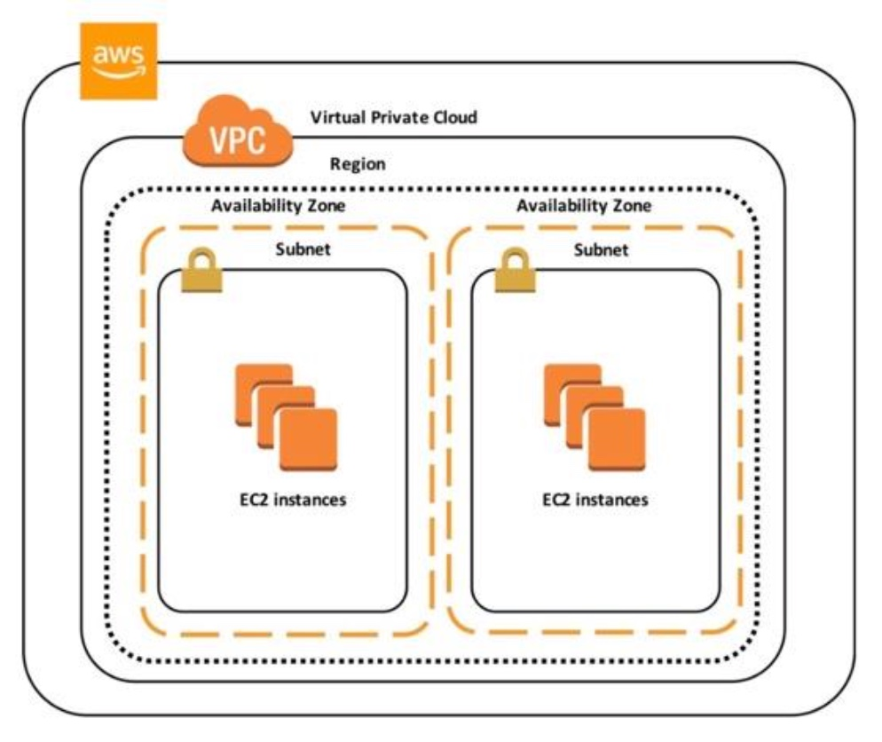
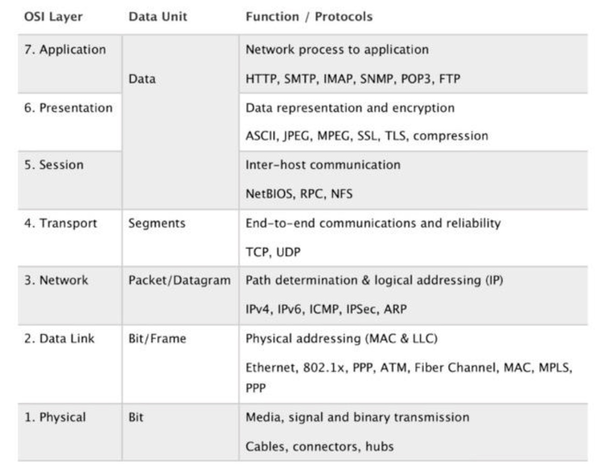
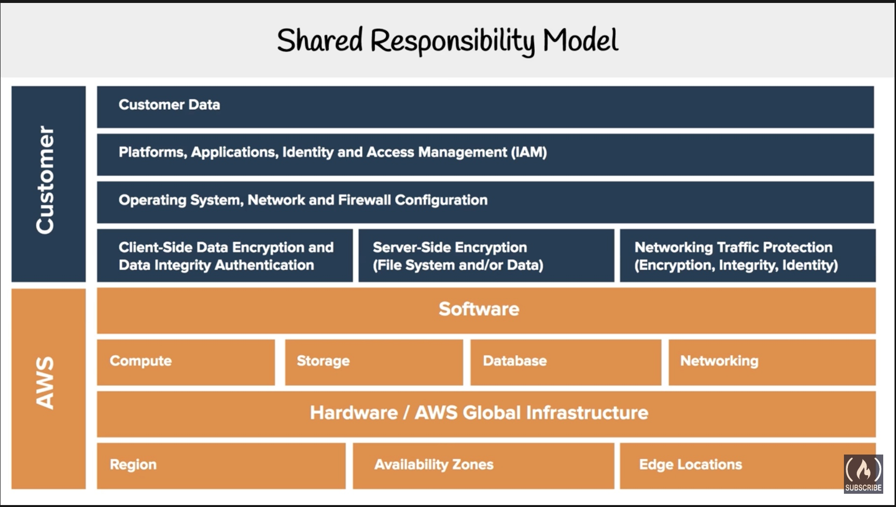
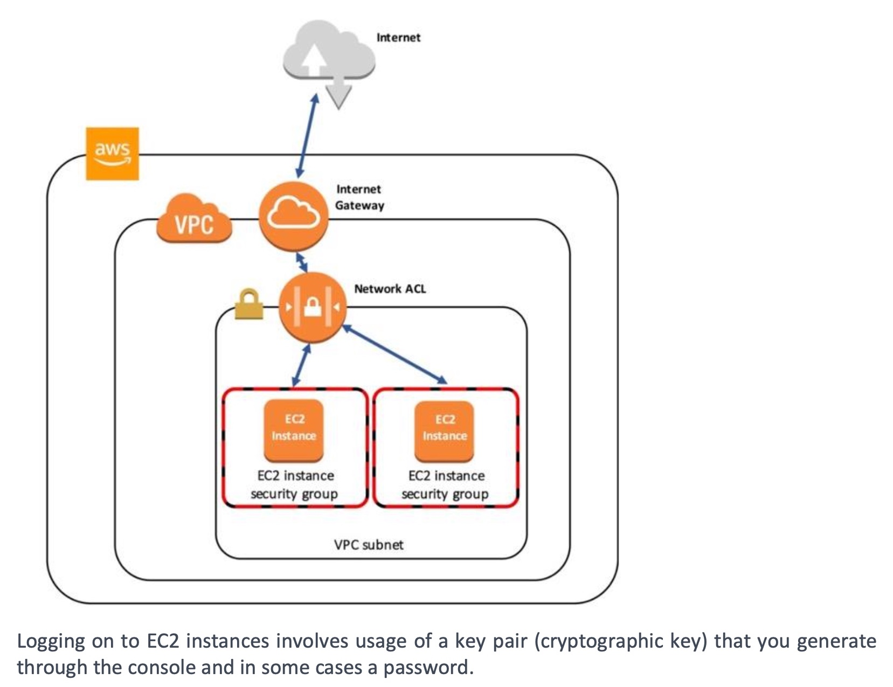

# Technology Overview

## Organizations & Accounts

### Organizations

Organizations allow you to centrally manage billing, compliance, control access, security & share resources across your AWS accounts.

- Billing
- Compliance
- Control Access
- Security
- Share resources

### Organization Units

Group of AWS account within an Organization which contain other organizations - creating an hierarchy.

### Root Account User

Its a single sign-in identity that has complete access to all services & resources in AWS account. Every account has a Root-account user.

### Service Control Policies

Gives central control over the allowed permission across all your AWS accounts in your organization, ensuring all your accounts stay within the organization's guidelines.

## AWS Networking

AWS Networking takes a recap of AWS Global Infrastructure (aws-ccp-02.md / aws-ccp-02.pdf)

| Name                        | Description                                                  |
| --------------------------- | ------------------------------------------------------------ |
| Region                      | Geographical Location of your network                        |
| AZ                          | Availability Zone - Data center of your AWS resources (us-east-1a) |
| VPC (Virtual Private Cloud) | Logically isolated section in your AWS cloud where you can launch AWS resources |
| Internet Gateway (IGW)      | Enables access to the internet                               |
| Route Tables                | Determine network traffic from where your subnets are redirected |
| NACLs                       | Network Access Control List - Acts as firewall :fire: at Subnet levels |
| Security Group              | Acts as firewall :fire: at Instance levels                   |
| Subnets                     | Logically partitioning of an IP Network, into smaller network segments (Eg: Public, Private subnet) |

### VPCs

Amazon Virtual Private Cloud (Amazon VPC) enables you to launch AWS resources into a virtual network that you've defined. This virtual network closely resembles a traditional network that you'd operate in your own data center, with the benefits of using the scalable infrastructure of AWS.

- *Amazon VPC is the networking layer for Amazon EC2.* 

You can create, access, and manage your VPCs using any of the following interfaces:

- **AWS Management Console** — Provides a web interface that you can use to access your VPCs.
- **AWS Command Line Interface (AWS CLI)** — Provides commands for a broad set of AWS services, including Amazon VPC, and is supported on Windows, Mac, and Linux, see [AWS Command Line Interface](https://aws.amazon.com/cli/).
- **AWS SDKs** — Provides language-specific APIs and takes care of many of the connection details, such as calculating signatures, handling request retries, and error handling, see [AWS SDKs](http://aws.amazon.com/tools/#SDKs).
- **Query API** — Provides low-level API actions that you call using HTTPS requests. Using the Query API is the most direct way to access Amazon VPC, see the [Amazon EC2 API Reference](https://docs.aws.amazon.com/AWSEC2/latest/APIReference/).

# AWS Services

## Network Services

AWS offers wide variety of network services that can be configured using - GUI, CLI & API endpoints. 

Important concepts of networking are:

- IP subnetting
- Routing & Gateways
- OSI Model
- Network virtualization

>  An IP (Internet Protocol) is a label used to identify a computer on a shared network

- IPv4 - has been around for much longer
- IPv6 - supports much larger address space
- IPv4 - 32 bit number
- Consists of - NETWORK identifier and a HOST identifier

> A subnet mask is prefix which determines which portion of the address is NETWORK & which port is a HOST identifier

### VPC

A Virtual Private Cloud is an isolated network environment on AWS. Think of it as private data center on cloud.

With VPC,  you can specify your own CIDR blocks, create IPv4, IPv6 addresses.

- VPC are created within an AWS region
- VPC Subnets are created within a AWS Availability Zone

### How Subnets work

- A VPC subnet is created within an Availability Zone
- You can have a minimum of 2 Subnets (as there are a min of 2 AZs) in each region
- Subnets can be either created as Private or Public.
- Private Subnet (Intranet) can ONLY be accessed via the AWS NAT gateway (NAT)
- Public Subnets can be be accessible publicly using the AWS Internet gateway (IGW)
- Each subnet must be associated to a route table
- Subnet : Route table association is 1 is to Many relationship

### VPC Wizard

The following are the installation types for VPC Wizard

- VPC with a Single Public Subnet
- VPC with Public & Privae Subnet
- VPC with Public & Private Subnet & VPN Hardware access
- VPC with Private Subnet only & Hardware VPN access

### VPN

A Virtual Private Network is extending your VPC on AWS to public or untrusted network. 

### NAT instances

- NAT instances are managed by **you**
- Used for enabling private subnet instances access to the Internet
- When creating NAT instances :arrow_right: Disable source/destination check
- NAT instances must be in a single public subnet
- NAT instances must be assigned to a security group

### AWS Direct Connect

Another alternative to VPN is to create a secure private network and use internet to connect your On-premise network to AWS.

## Database Services

The following is a list of 8 Database services offered by AWS -

| Database           | Description                                                  |
| ------------------ | ------------------------------------------------------------ |
| DynamoDB           | NoSQL key/value database (eg: **Cassandra / Firebase**)      |
| DocumentDB         | NoSQL Document database that is **MongoDB** compatible       |
| RDS                | Relational Database Service that supports multiple engines (Engines - **MySQL, PostgreSQL, Maria DB, Oracle, Microsoft SQL server, Aurora**) |
| Aurora             | **MySQL** (5x faster) & **PostgreSQL** (3x faster) database fully managed Relational Database - greater performance. Also more expensive. Enterprise level. |
| Aurora Server less | Database that only runs when you need it - just like AWS Lambda services. Most in-expensive RDS |
| Neptune            | Managed Graph Database                                       |
| Redshift           | Columnar Database, Petabyte warehouse (1000 TB = 1 PB !!)    |
| Elasticache        | **Redis** or **Memcached** database. Used for Caching solutions. Open-source |

> NOTE: Amazon RDS supports the following databases only - Amazon Aurora, PostgreSQL, MySQL, MariaDB, Oracle Database, and Microsoft SQL Server.
>
> Amazon RDS is Online Transaction Processing (OLTP) type Database
>
> Aurora is Amazon's proprietary Database
>
> DynamoDB stores 3 geographically duplicated replicas of each table for High availability & data durability.
>
> Data in DynamoDB is synchronously replicated across 3 facilities (AZs) in a region

### Amazon RDS

- RDS can scale vertically
- For _Read-Heavy_  use cases you can scale horizontally by creating replicas
- For Production DBs, Amazon recommends using Multi-AZ which creates synhcronous replicated standby in another AZ
- With Multi-AZ, RDS can failover to standby mode without administration intervention

#### Anti-Patterns

- If your DB uses queries or indexes without complex joins or complex transactions, consider using a NoSQL database instead.

- If you have large binaries (audio, video, images) - it is better recommended to use a S3 bucket to store the file and store the metadata onto the Database.

### No SQL Database

- DynamoDB is Amazon's NoSQL DB
- Data in DynamoDB is synchronously replicated across 3 facilities (AZs) in a region

#### Anti-Patterns

- If your Schema cannot be de-normalized Or you want to use complex joins or queries, consider switching to RDS database instead
- If you have large binaries (audio, video, images) - it is better recommended to use a S3 bucket to store the file and store the metadata onto the Database.

### Data Warehouse

- A Specialized RDS Database, optimized for reporting & analyzing large amounts of data
- can combine data from disparate sources making them available for analysis & decision-making
- Amazon Redshift is a managed RDS Data warehouse
- Optimized to operate 1/10th cost compared to traditional data-warehouses
- Data is continously backed up to S3

### Anti-Patterns

- Because Redshift is a SQL-based relational database it is compatible with other RDS applications & business intelligence tools
- Although Redshift works as a typical RDS Database & provides Online Transaction Processing (OLTP), it is not designed for these type of workloads

### Search Databases

- AWS offers AWS CloudSearch & ElasticSearch (ES)
- Offers high degree of search capabilities - free text format and index searching with customizable result ranking, faceting for filtering, synonyms, stemming ..etc.,

## Provisioning Services

| Services          | Description                                                  |
| ----------------- | ------------------------------------------------------------ |
| Elastic Beanstalk | AWS service for deploying & developing Web applications & services developed using Java, Node JS. Provides an easy installation wizard. (Heroku for AWS :smile:) |
| OpsWorks          | Configuration Management service that provides managed instances of **Chef** & **Puppet** |
| Cloud Formation   | Infrastructure as Code, JSON or YAML                         |
| AWS QuickStart    | pre-made packages that can launch & configure your AWS compute, network, storage & other services required to deploy a workload on AWS |
| AWS Marketplace   | Digital catalogue of **thousands** of AWS listings - from independent software vendors that you can - find, buy, test & deploy software |

## Computing Services

The following is a list of Computing services offered by AWS

- :exclamation: The Instance Metadata Query tool allows you to query the instance metadata without having to type out the full URI or category names

| Instances         | Description                                                  |
| ----------------- | ------------------------------------------------------------ |
| EC2               | Elastic Cloud Compute - Highly configurable server. consists of CPU, Memory, Network & Operating system. |
| ECS               | Elastic Container Service - Imagine ***Docker as a Service*** - A Highly scalable, high-performance, container orchestration service that supports Docker containers, pay for EC2 instances. |
| Fargate           | Microservices where you don't think about the infrastructure. Play per task. It's an evolution of ECS. |
| EKS               | Elastic Kubernetes Service - Imagine ***Kubernetes as a Service*** - easy to deploy, manage & scale containerized applications using Kubernetes. |
| Lambda            | Lambda Server less Functions, run code without provisioning or managing servers. You pay only for the compute time you consume |
| Elastic Beanstalk | orchestrates various other AWS services including, EC2, S3, SNS, Cloudwatch, Autoscaling & Elastic Load Balancers |
| AWS Batch         | plans, schedules & executes your batch computing workloads across the full range of AWS compute services, such as - EC2 & Spot instances. |

## Storage Services

The following is a list of  services offered by AWS related to Storage & data access.

| Storage         | Description                                                  |
| --------------- | ------------------------------------------------------------ |
| S3              | Simple Storage Service - File system storage service provided by AWS (logical partition storage) |
| S3 Glacier      | Low-cost storage for archiving & long-term backup            |
| Storage Gateway | Hybrid Cloud storage with local caching 1. File gateway, 2. Volume gateway 3. Tape Gateway. Extension of on-prem storage to cloud. |
| EBS             | Elastic Block Storage - Unlike S3, it consists of virtual Hard-drives that you attach to your EC2 instances for storage. Only attach to one EC2 instance per EBS. |
| EFS             | Elastic File Storage - File storage solution, mountable to multiple EC2 instances at the same time. |
| Snowball        | Physically migrate a lot of data via a computer science - 50-80 TB |
| Snowball Edge   | A Better version of Snowball - ~100 TB                       |
| Snowmobile      | Shipping container, pulled by a Semi-trailer truck - 100 PB  |

### Amazon S3

The following are the rules to be followed when naming S3 instances

- Names should be unique across all of AWS
- Number of characters can be anywhere between 3-63 characters in length
- Names can only be lowercase, hyphens & numbers
- Names cannot be formatted IP addresses

## Business Centric Services

Consists of AWS Enterprise related services

| Name           | Description                                                  |
| -------------- | ------------------------------------------------------------ |
| Amazon Connect | Cloud based call center service, you can set it up in few clicks. Record, inbound calls. Setup call workflows. |
| WorkSpaces     | Virtual Remote Desktop - AWS service for provisioning either Windows or Linus OS. scalable upto 1000 desktops |
| WorkDocs       | A content creation & collaboration service - AWS version of Sharepoint - CRUD content |
| Chime          | AWS solution for Online Meetings, Video Conferencing, Business calling. Similar to Skype + Slack |
| WorkMail       | AWS service for managed Business emails. Online GMail for AWS. |
| Pinpoint       | Marketing Campaign Management system, send E-newsletters,  Targeted emails, SMS, Push notifications. |
| SES            | Simple Email Service - Cloud based email service designed for marketers & application developers to send marketing, notifications & email. Supports HTML content emails unlike SNS which only sends simple Unicode emails. |
| Quicksight     | A Business Intelligence BI service. Generate & share visualizations, charts. |

## Enterprise Integration

Enterprise Integration is all about "Going Hybrid".

- List of AWS services for bringing on-premise technologies over to cloud.

| Name             | Description                                                  |
| ---------------- | ------------------------------------------------------------ |
| Direct Connect   | dedicated Gigabyte network connection for your on-premise to AWS. |
| VPN              | Setup a secure Virtual Private Network connection from on-prem to AWS. Site to site (direct on-prem to AWS) or client VPN (from clients to AWS). |
| Storage Gateway  | AWS hybrid storage services allows your On-Premise applications to use AWS cloud storage. Useful for backup, archiving, disaster recovery. |
| Active Directory | AWS Directory Services for Microsoft Managed Active Directories. |

## Logging Services

List of AWS services for Logging & Monitoring purposes.

| Name                        | Description                                                  |
| --------------------------- | ------------------------------------------------------------ |
| CloudTrail                  | Logs all API calls between AWS services (_who is to blame for this EC2 spin up...?_) |
| CloudWatch                  | is a collection of multiple services for Logging purposes    |
| 1. CloudWatch **Logs**      | Performance data about AWS services. CPU Utilization, Memory, Network, Application Logs. Eg. Rails, Nginx, Lambda |
| 2. CloudWatch **Metrics**   | Represents a time-ordered set of data points. A variable to monitor |
| 3. CloudWatch **Events**    | Trigger an event based on a condition / situation - Exceeding Space - trigger email |
| 4. CloudWatch **Alarms**    | Trigger notifications based on metrics. You can specify a Threshold. |
| 5. CloudWatch **Dashboard** | Create visualizations based on metrics.                      |

# Security

## Shared Responsibility Model

The following diagrams show the shared responsibility model between a AWS customer & AWS management

### High-level Overview

### Detailed Overview

### Shared Controls

Controls which apply to both Infrastructure Layer (AWS) & Application Layer (Customer), but in separate contexts & perspectives

Examples include

- **Patch Management** - AWS is responsible for patching & fixing flaws within the infrastructure, Customer is responsible for patching their Guest OS & Applications.
- **Configuration Management** - AWS maintains the configuration within the infrastructure, Customer is responsible for configuring their Gust OS, Database & Applications.
- **Awareness & Training** - AWS trains their AWS employees, Customer trains his company employees

## AWS Compliance Programs

To get the full list of compliances that AWS service provides. Click the following link - [Compliance Programs Link](https://aws.amazon.com/compliance/programs/)

### Compliances Overview

## AWS Artifact

### _How do we know AWS meets compliance ?_

AWS "Artifact" is a service which provides compliance & security details -

- No cost, self-service portal
- On-demand access to AWS' compliance reports
- These checks are based on Global compliance frameworks

- Ability to report out - **PDF*** (Adobe Acrobat reader only), **XLSX**

## Amazon Inspector

### *How do we prove that a EC2 instance is harden ?*

> "**Hardening**" - The act of removing as many security risks as possible

- AWS Inspector runs a **security benchmark** against specific EC2 instances. You can run a varierty of security benchmarks.
- Can perform both Network & Host assessments
  - Install AWS agent on your EC2 instance
  - Run an assessment for your targets
  - Review findings & remedy security issues.

> One very popular benchmark you can run is CIS which as 699 checks!  CIS- Center for Internet Security

## AWS WAF - Web Application Firewall

## AWS Shield

AWS Shield is a managed DDos (Distributed Denial of Service) protection service that safeguards applications running on AWS

- There are two tiers of AWS shield
  - Standard
  - Advanced

### _What is a DDoS attack ?_

A Malicious attempt to disrupt normal traffic by flooding a website with large amount of fake traffic.

- :exclamation: When you route your traffic using **AWS Route 53** or **CloudFront**, you are using AWS Shield standard.
- All AWS customers benefit from automatic protections of AWS shield standard, at no additional cost
- Protects you against Layer 3,4,7 attacks
  - 7 - Application layer
  - 4 - Transport layer
  - 3 - Network layer

## Penetration Testing

## Guard Duty

Amazon Service which protects resources using IDS & IPS

### _What is IDS / IPS_ ?

- Intrusion Detection System & Intrusion Protection System

- A Device or Software that monitors a network or systems for malicious activity or policy violation
- Guard duty is threat detection service
- Logs stored under Guard Duty :arrow_right: Findings

## Key Management Service

A managed service that makes it easy for you to create & control encrypted keys used to encrypt your data.

- KMS is a multi-tenant HSM (hardware security model)
- Encrypt your data with a simple checkbox
- KMS uses Envelope Encryption

### Envelope Encryption

When you encrypt your data key with a master key as an additional level of security

## Amazon Macie

Fully managed service that continuously monitors S3 data access activity for anomolies.

- Generates detailed alerts when it detects risks
- :exclamation: Uses Machine learning to analyze your CloudTrail logs
- Identifies your most risk users which leads to a compromise

## Security Groups & NACLs

The following shows important differences between Security Groups & NACLs

### Security Groups

- Act as :fire: firewall at **instance** level
- Implicitly denies all traffic
- You control the allow rules
- Eg: Allow EC2 access on port 22 for SSH

### NACLs

Network Access Control Lists

- Act as :fire: firewall at **subnet** level
- You create both allow & deny rules
- Cherry pick IP address to deny access to AWS resources
- Eg: Block a specific IP for access which might have been flagged for abuse

## Amazon VPN

Virtual Private Network lets you establish a secure & private tunnel from your network or device to AWS global network

- **AWS Site-to-Site VPN**: securely connect on-premises network or branch office to VPC.
- **AWS Client VPN**: securely connect users to AWS network or on-premises networks.

## Removing Single Points of Failure

The following the topics that deal with - High Availability, Redundancy, 

### High Availability

A system is considered _"Highly Available"_ when it can withstand the failure of individual or multiple components

### Redundancy

- Single Points of Failure can be removed by introducing Redundancy
- There are 2 types of Redundancy
  - Standby redundancy - When a resource fails, functionality is reovered from a standby resource using a process called **failover**. Standby redundancy typically takes some time to complete
  - Active redundancy - Each request is dsitributed to multiple redundany compute resources so that if one fails,  the rest can simply absorb the rest of the workload.

### Detect Failure

- Build as much automation as possible, to detect failure quickly and to react quickly
- :exclamation: Services like **ELB** and **Route 53** mask failure by routing traffic to healthy endpoints
- Autoscaling can be configured to automatically replace unhealthy nodes
- You can also replace unhealthy nodes by **EC2 Auto-recovery**, **OpsWorks** & **Elastic Beanstalk**

### Durable Data Storage

Replication can Horizontally scale the read capacity. But it also increases Data Durability & Reliability. Replication can be of 3 types -

- **Synchronous Replication**
  - Transaction is acknowledged only after the Data has been copied in both primary & seondary replica instances
- **Asynchronous Replication**
  - Changes in the Primary replica instance are not immediately reflected in its secondary instances (uses replication lag)
  - can horizontally scale the read capacity
- **Quoram Based Replication**
  - Combines both Synchronous & Asynchronous replication & is used for large scale distributed data-systems

# Variation Study

## Cloud - Names

The following is a list of names which begin with the prefix - cloud, but have completely different meaning and responsibilities

| Service                  | Description                                                  |
| ------------------------ | ------------------------------------------------------------ |
| CloudFormation           | Infrastructure as code, setup services via temptation eg: YAML, JSON |
| CloudTrail               | Logs API call between AWS services (who we can blame ?)      |
| CloudFront               | Content Distribution Network                                 |
| CloudWatch               | All about Logging, Alerts, Notification                      |
| :exclamation:CloudSearch | Search Engine, You have an ecommerce website & you want to add a search bar |

## Connect - services

Lists different services that have the word - "Connect" in them

| Connect        | Description                                                  |
| -------------- | ------------------------------------------------------------ |
| Direct Connect | Dedicated Fibre optics connection from Data Center to AWS    |
| Amazon Connect | Call center service                                          |
| Media Connect  | New version of Elastic Transcoder, converts video to different video types |

## Elastic Transcoder vs Media Convert

Both the following services are used for - Transcode videos

| Elastic Transcoder                     | AWS Elemental Media Convert            |
| -------------------------------------- | -------------------------------------- |
| The old way of encoding media          | The new way of encoding media          |
| Transcodes videos to streaming formats | Transcodes videos to streaming formats |
|                                        | Overlays images (Watermark)            |
|                                        | Insert Video clips                     |
|                                        | Extracts captions data                 |
|                                        | Robust UI                              |

## SNS vs SQS

Both the following services are used for connecting - Your Applications via Messages

| SNS - Simple Notification Service                            | SES - Simple Email Service                                   | SQS - Simple Queue Service                                   |
| ------------------------------------------------------------ | ------------------------------------------------------------ | ------------------------------------------------------------ |
| Practical & Internal                                         | Professional, Marketing, Emails                              | Scheduled, Queues                                            |
| Pass along messages eg: PubSub mail service                  | A cloud based email service Eg: Twilio SendGrid              | Queue up messages, Guaranteed Delivery                       |
| Send notification to subscribers of topics via multiple protocol eg: HTTP, Email, SQS, SMS | Supports Lambda operations                                   | Places messages into a queue. Applications pull queue using AWS SDK |
| SNS is generally used for sending "plain text emails". Best eg: Billing alarms | SES can send HTML email, SNS cannot                          |                                                              |
| Can retry sending in case of failure of HTTPS                | - SES can receive inbound emails.   - SES can create Email template  - Custom domain name email  - Monitor your email reputation | - Can retain a message upto 14 days - Can send msgs in a sequential order or in parallel - Can ensure only one message is sent - Can ensure msgs delivered atleast once |
| Really good for web-hooks, simple internal emails, triggering lambda functions |                                                              | Really good for delayed tasks, queueing up emails            |
| Eg: Pusher, PubNub                                           |                                                              | Eg: RabbitMQ, Sidekiq                                        |

### SNS

SNS provides instantaneous, push-based delivery (no polling)

- Closely integrated with CloudWatch services
- Datatype is JSON
- Supports the following Transport Protocols
  - HTTP / HTTPS
  - Email / Email-JSON
  - SQS
  - SMS
- Subsribers for SNS are
  - HTTP / HTTPS
  - AWS Lambda
  - Application
  - Email
  - SQS

## Inspector vs Trusted Advisor

AWS Trusted Advisor scans your AWS infrastructure & provides guidance on AWS best practices in the following categories

- Cost Optimization
- Performance
- Security
- Fault Tolerance
- Service Limits

Both are Security tools & they both perform audits

| Amazon Inspector                                             | Trusted Advisor                                              |
| ------------------------------------------------------------ | ------------------------------------------------------------ |
| Audits a single EC2 instance you've selected                 | Gives you a holistic view of recommendations across multiple services & best practices |
| Generates a report from a long list of security checks i.e., :exclamation:699 checks | Doesn't generate out a PDF report                            |
| Generates PDF report                                         | You should enable MFA on your root account when using trusted advisor. |
|                                                              | advices you on Cost Optimization, Performance, Security & Fault tolerance |

AWS Trusted advisor comes in 2 versions

- Core Check & Recommendations
  - 7 Core checks
  - Include - _S3 bucket permissions, Security Groups, IAM Use, MFA on root accounts, EBS Public Snapshots, RDS Snapshots_
- Full Trusted Advisor Check
  - Full set of checks to optimize your AWS infrastructure
  - Checks on all five categories mentioned above
  - Additional benefits include - _Weekly notifications, alerts, Automated actions with CloudWatch & programmatic access using AWS SDK._

## AWS Artifact vs AWS Inspector

Both Artifact & Inspector compile out PDFs

| AWS Artifact                                                 | AWS Inspector                                                |
| ------------------------------------------------------------ | ------------------------------------------------------------ |
| Why should an enterprise trust AWS ?                         | How do we know this EC2 instance is Secure ?                 |
| Generates a security report that's based on **global compliance frameworks** | Runs a script that analyze your EC2 instance then generates a PDF report telling you which security check has passed |
| Eg: Service Organization Control (SOC) & Payment Card Industry (PCI) | Audit Tool for security of EC2 instances                     |
|                                                              | Uses an agent installed on EC2 instances, EC2 instance must be tagged |

## ALB vs NLB vs CLB

All of the above deal with Load balancing when it comes to AWS Services

> NOTE: can attach Amazon Certification Manager (ACM) SSL certificate

|     Application      |                           Network                            |                        Classic (old)                         |
| :------------------: | :----------------------------------------------------------: | :----------------------------------------------------------: |
|   Layer 7 Requests   |                   Layer 4 IP protocol data                   |                      Layer 4 & Layer 7                       |
| HTTP & HTTPS traffic |   TCP & TLS traffic where extreme performance is required    | Intended for applications that were built within the EC2-class network |
|    Can attach WAF    | Capable of handling millions of requests per second while maintaining ultra-low-latencies |                  Doesn't use Target  groups                  |
|                      | Optimized for sudden & volatile traffic patterns while using a single static IP address per availability zone. |                                                              |

# AWS Architecture

- [AWS Link to - 5 pilllars to well architected Framework](https://aws.amazon.com/blogs/apn/the-5-pillars-of-the-aws-well-architected-framework/)

## 5 Pillars of Well Architected Framework

The 5 pillars of Well Architected Framework include -

1. Operational Excellence
2. Security
3. Reliability
4. Performance Efficiency
5. Cost Optimization

## 1. Operational Excellence

The Operational Excellence pillar includes the ability to support development and run workloads effectively, gain insight into their operation, and continuously improve supporting processes and procedures to delivery business value.

### Design Principles

There are five design principles for operational excellence in the cloud:

- Perform operations as code
- Make frequent, small, reversible changes
- Refine operations procedures frequently
- :exclamation:Anticipate failure
- Learn from all operational failures

### Best Practices

- Operations teams need to understand their business and customer needs so they can support business outcomes. 
- Ops creates and uses procedures to respond to operational events, and validates their effectiveness to support business needs. 
- Ops also collects metrics that are used to measure the achievement of desired business outcomes.

- Everything continues to change—your business context, business priorities, customer needs, etc. 
- It’s important to design operations to support evolution over time in response to change and to incorporate lessons learned through their performance.

## 2. Security

The Security pillar includes the ability to protect data, systems, and assets to take advantage of cloud technologies to improve your security. You can find prescriptive guidance on implementation in the [Security Pillar whitepaper](https://d1.awsstatic.com/whitepapers/architecture/AWS-Security-Pillar.pdf).

### Design Principles

There are seven design principles for security in the cloud:

- Implement a strong identity foundation
- Enable traceability
- Apply security at all layers
- Automate security best practices
- :exclamation:Protect data in transit and at rest
- Keep people away from data
- Prepare for security events

### Best Practices

- Before you architect any workload, you need to put in place practices that influence security. You’ll want to control who can do what. 
- In addition, you want to be able to identify security incidents, protect your systems and services, and maintain the confidentiality and integrity of data through data protection.
- You should have a well-defined and practiced process for responding to security incidents. These tools and techniques are important because they support objectives such as preventing financial loss or complying with regulatory obligations.

- The [AWS Shared Responsibility Model](https://aws.amazon.com/compliance/shared-responsibility-model/) enables organizations that adopt the cloud to achieve their security and compliance goals. 

- The AWS Cloud also provides greater access to security data and an automated approach to responding to security events.

## 3. Reliability

The Reliability pillar encompasses the ability of a workload to perform its intended function correctly and consistently when it’s expected to. This includes the ability to operate and test the workload through its total lifecycle. You can find prescriptive guidance on implementation in the [Reliability Pillar whitepaper](https://d1.awsstatic.com/whitepapers/architecture/AWS-Reliability-Pillar.pdf).

### Design Principles

There are five design principles for reliability in the cloud:

- Automatically recover from failure
- Test recovery procedures
- :exclamation:Scale horizontally to increase aggregate workload availability
- :exclamation:Stop guessing capacity
- :exclamation:Manage change in automation

### Best Practices

- To achieve reliability, you must start with the foundations—an environment where service quotas and network topology accommodate the workload.
-  The workload architecture of the distributed system must be designed to prevent and mitigate failures. 
- The workload must handle changes in demand or requirements, and it must be designed to detect failure and automatically heal itself.
- Before architecting any system, foundational requirements that influence reliability should be in place. For example, you must have sufficient network bandwidth to your data center. 
- With AWS, most of these foundational requirements are already incorporated or may be addressed as needed. The cloud is designed to be essentially limitless, so it is the responsibility of AWS to satisfy the requirement for sufficient networking and compute capacity, while you are free to change resource size and allocation, such as the size of storage devices, on demand.

## 4. Performance Efficiency

The Performance Efficiency pillar includes the ability to use computing resources efficiently to meet system requirements, and to maintain that efficiency as demand changes and technologies evolve. You can find prescriptive guidance on implementation in the [Performance Efficiency Pillar whitepaper](https://d1.awsstatic.com/whitepapers/architecture/AWS-Performance-Efficiency-Pillar.pdf).

### Design Principles

There are five design principles for performance efficiency in the cloud:

- Democratize advanced technologies
- :exclamation: Go global in minutes
- :exclamation: Use serverless architectures
- :exclamation: Experiment more often
- :exclamation: Consider mechanical sympathy

### Best Practices

Take a data-driven approach to building a high-performance architecture. Gather data on all aspects of the architecture, from the high-level design to the selection and configuration of resource types.

Reviewing your choices on a regular basis ensures you are taking advantage of the continually evolving AWS Cloud. Monitoring ensures you are aware of any deviance from expected performance. Make trade-offs in your architecture to improve performance, such as using compression or caching, or relaxing consistency requirements

The optimal solution for a particular workload varies, and solutions often combine multiple approaches. Well-Architected workloads use multiple solutions and enable different features to improve performance

## 5. Cost Optimization

The Cost Optimization pillar includes the ability to run systems to deliver business value at the lowest price point. You can find prescriptive guidance on implementation in the [Cost Optimization Pillar whitepaper](https://d1.awsstatic.com/whitepapers/architecture/AWS-Cost-Optimization-Pillar.pdf).

### Design Principles

There are five design principles for cost optimization in the cloud:

- Implement cloud financial management
- Adopt a consumption model
- :exclamation: Measure overall efficiency
- :exclamation: Stop spending money on undifferentiated heavy lifting
- Analyze and attribute expenditure

### Best Practices

As with the other pillars, there are trade-offs to consider. For example, do you want to optimize for speed to market or for cost? In some cases, it’s best to optimize for speed—going to market quickly, shipping new features, or simply meeting a deadline—rather than investing in up-front cost optimization.

Design decisions are sometimes directed by haste rather than data, and as the temptation always exists to overcompensate rather than spend time benchmarking for the most cost-optimal deployment. This might lead to over-provisioned and under-optimized deployments.

Using the appropriate services, resources, and configurations for your workloads is key to cost savings

## Design Principles

### Scalability

Systems are expected to grow over time and are required to be scalable

| Horizontal Scaling                                           | Vertical Scaling                                             |
| ------------------------------------------------------------ | ------------------------------------------------------------ |
| Add more instances as demand increases                       | Add more CPU / RAM to existing resources as demand increases |
| No downtime required to scale up or down                     | Requires a restart to scale up or down                       |
| Automatic scaling using AWS Autoscaling                      | Would require automation scripts                             |
| Unlimited scalability                                        | Scalability limited to maximum instance size                 |
| Stateless applications can scale horizontally                | RDS instances can scale vertically                           |
| Eg: EC2, Lambda                                              |                                                              |
| RDS - For Read-Heavy use-cases you can scale horizontally using replicas |                                                              |

## Instantiating Compute Resource

You dont have to MANUALLY setup new resources & their configuration

Use Automated steps to configure new instances. This can be done in following ways

### Bootstrapping

Execute automated bootstraping actions that override default configuration

- This includes scripts that install software and copy data
- Parameterize Configuration

### Golden Image

Some resource can be created from a **Golden Image**. A **Golden Image** is a snapshot of a particular state of that resource.

- Examples are EC2, RDS, EBS volumes
- Faster than Bootstrapping

### Infrastructure as Code

- AWS assets are programmable, you can apply techniques, best practices & tools which 

# Questions & Answers

### Question 01

_AWS RDS supports six database engines. From the list below, choose three engines supported by Amazon RDS? (Choose 3 answers)_

- Oracle :white_check_mark:
- MySQL :white_check_mark:
- DB2 :x:
- FoxPro :x:
- Microsoft SQL :white_check_mark:

#### Explanation

Amazon RDS is available on several database instance types - optimized for memory, performance, or I/O - and provides you with six familiar database engines to choose from, including Amazon Aurora, PostgreSQL, MySQL, MariaDB, Oracle Database, and SQL Server.

Although you can host other databases on EC2 Instances, only the above are natively supported by the Amazon Relational Database Management Service (RDS)

Ref: https://youtu.be/eMzCI7S1P9M

### Question 02

_One of the seven design principals of the Security Pillar in the Well-Architected Framework refers to the concept of applying security at all layers. Which two firewall options can you configure to protect your EC2 Instances deployed in a VPC? (Choose 2 answers)_

- IAM Groups :x:
- Security Groups :white_check_mark:
- AWS WAF :x:
- Amazon Macie :x:
- NACLs :white_check_mark:

#### Explanation

- NACLs are firewalls that protect the entire subnet and allow you to define both allow and deny rules for traffic that flows into and out of the subnet. This protects your EC2 Instance the Subnet. 

- Security Groups are firewalls that protect the individual EC2 Instance and further restrict what traffic can be allowed to the instance.

- Amazon Macie is an incorrect answer. Amazon Macie is a security service that uses machine learning to automatically discover, classify, and protect sensitive data in AWS. Amazon Macie recognizes sensitive data such as personally identifiable information (PII) or intellectual property (such as your corporate application source codes) and provides you with dashboards and alerts that give visibility into how this data is being accessed or moved. The fully managed service continuously monitors data access activity for anomalies and generates detailed alerts when it detects the risk of unauthorized access or inadvertent data leaks. Amazon Macie is available to protect data stored in Amazon S3.

- AWS WAF is an incorrect answer. AWS WAF is a web application firewall that helps protect your web applications or APIs against common web exploits. AWS WAF can be used to control how traffic reaches your applications by enabling you to create security rules that block common attack patterns, such as SQL injection or cross-site scripting, and rules that filter out specific traffic patterns you configure.

- IAM Groups are an incorrect answer. IAM Groups are designed to club together IAM Users who share common job functions and grant IAM Policies to. These have nothing to do with protecting network traffic to EC2 instances.

  

### Question 03

_Which storage solution enables you to share a common file system across multiple Linux based EC2 Instances that can be used to support applications which require access to data with very low latency connectivity?_

- NTFS :x:
- S3 :x:
- EFS :white_check_mark:

- EBS :x:

#### Explanation

- Amazon EFS is a fully managed service providing shared file system storage for Linux workloads. It provides a simple interface allowing you to create and configure file systems quickly and manages the file storage infrastructure for you, removing the complexity of deploying, patching, and maintaining the underpinnings of a file system. You can use to provide your application that runs on multiple EC2 instances to share a common file system that offers very low latency connectivity.

- The answer, “EBS” is incorrect because although you can configure a file system on EBS Volumes, you cannot share an EBS volume across multiple EC2 Instances.

- The answer, “S3” is incorrect because it is not a file system. Also, EFS would offer much lower latency. Amazon S3 is object storage and ideally used to host assets such as documents, images, and videos which can be referenced by web applications.

- The answer, “NTFS” is incorrect because this is a file system, specifically a Windows File System and not the actual storage option.

### Question 04

_Your organization hosts multiple AWS Accounts with multiple VPCs. You would like to connect these VPCs together and centrally manage connectivity policies. Which AWS service enables you to connect multiple VPCs configured as a hub that controls how traffic is routed among all the connected networks which act like spokes?_

- AWS Transit Gateway :white_check_mark:
- AWS VPC Peering :x:
- AWS Global Accelerator :x:
- AWS Virtual Private Gateway :x:

#### Explanation

- AWS Transit Gateway is a service that enables customers to connect their Amazon Virtual Private Clouds (VPCs) and their on-premises networks to a single gateway. This allows you to connect your on-premise network and all your VPCs in a hub and spoke configuration which significantly simplifies management and reduces operational costs because each network only has to connect to the Transit Gateway and not to every other network.

- The answer, ‘AWS Global Accelerator’, is incorrect. AWS Global Accelerator is a service that improves the availability and performance of your applications with local or global users. It provides static IP addresses that act as a fixed entry point to your application endpoints in a single or multiple AWS Regions, such as your Application Load Balancers, Network Load Balancers, or Amazon EC2 instances.

- The answer, ‘AWS VPC Peering’, is incorrect. While VPC Peering allows you to connect two VPCs to each other, It goes not enable you to centrally manage multiple VPCs connections centrally. You could configure all your VPCs with individual peering connections, but this becomes very difficult to manage.

- The answer, ‘AWS Virtual Private Gateway’, is incorrect. AWS Virtual Private Gateway is a component of your Site to Site VPN connection that needs to be configured to build out a VPC tunnel with your on-premise network.

- Ref: https://aws.amazon.com/transit-gateway/

### Question 05

_You wish to configure a bucket that will enforce a policy that enables anonymous to access its content if they connect to the data from the Corporate and branch offices as part of your security strategy. Which S3 configuration feature will enable you to define the IP Ranges from where you will allow access to the data?_

- NTFS Permissions :x:
- Bucket Policy :white_check_mark:
- NACLs :x:
- Security Groups :x:

#### Explanation

- S3 bucket policies specify what actions are allowed or denied for which principals on the bucket that the bucket policy is attached to. Bucket Policies enable you to also define conditional statements so that you can restrict access based on location for example. Also, note that S3 supports bucket policies of up 20 kb.

- Security Groups is an incorrect answer because these are used to protect EC2 Instances by enabling you to only allow traffic inbound/outbound on specific ports

- NTFS Permissions is an incorrect answer. NTFS (NT File System) permissions are available to drives formatted with NTFS. The advantage with NTFS permissions is that they affect local users as well as network users and they are based on the permission granted to each individual user at the Windows logon, regardless of where the user is connecting.

- Network Access Control Lists (NACLs) is an incorrect answer. NACL is a VPC Firewall security services that enable you to configure which inbound and outbound ports you can open at a subnet level,

- Ref: https://aws.amazon.com/blogs/security/iam-policies-and-bucket-policies-and-acls-oh-my-controlling-access-to-s3-resources/

### Question 06

_Which AWS Service enables developers to analyze and debug applications, identifying the root cause of performance issues and errors?_

- AWS CloudTrail :x:
- AWS X-Ray :white_check_mark:
- Access Analyzer :x:
- AWS Trusted Advisor

#### Explanation

- AWS X-Ray helps developers analyze and debug production, distributed applications, such as those built using a microservices architecture. With X-Ray, you can understand how your application and its underlying services are performing to identify and troubleshoot the root cause of performance issues and errors.

- The answer, ‘AWS CloudTrail’ is incorrect. AWS CloudTrail is a service that enables governance, compliance, operational auditing, and risk auditing of your AWS account. With CloudTrail, you can log, continuously monitor, and retain account activity related to actions across your AWS infrastructure.

- The answer, ‘AWS Trusted Advisor’ is incorrect. AWS Trusted Advisor provides real-time guidance to help you provision your resources following AWS best practices. To help you maximize utilization of Reserved Instances, AWS Trusted Advisor checks your Amazon EC2 computing-consumption history and calculates an optimal number of Partial Upfront Reserved Instances. Recommendations are based on the previous calendar month's hour-by-hour usage aggregated across all consolidated billing accounts.

### Question 07

_Which AWS Service can be used to capture, transform, and load streaming data into Amazon S3, Amazon Redshift, Amazon Elasticsearch Service, and Splunk, enabling near real-time analytics with existing business intelligence?_

- AWS Kinesis Firehose :white_check_mark:
- AWS Kinesis Video Streams :x:
- AWS S3 :x:
- AWS Athena :x:

#### Explanation

- Amazon Kinesis Data Firehose provides a simple way to capture, transform, and load streaming data with just a few clicks in the AWS Management Console. It is integrated with Amazon S3, Amazon Redshift, and Amazon Elasticsearch Service and you can capture, transform, and load streaming data. From the AWS Management Console, you can point Kinesis Data Firehose to an Amazon S3 bucket, Amazon Redshift table, or Amazon Elasticsearch domain.

- The answer ‘Kinesis Video Streams’ is incorrect. Amazon Kinesis Video Streams makes it easy to securely stream video from connected devices to AWS for analytics, machine learning (ML), playback, and other processing. Kinesis Video Streams automatically provisions and elastically scales all the infrastructure needed to ingest streaming video data from millions of devices.

- The answer, ‘Amazon Athena’ is incorrect. Amazon Athena is an interactive query service that makes it easy to analyze data in Amazon S3 using standard SQL. Athena is serverless, so there is no infrastructure to manage, and you pay only for the queries that you run.

- The answer, ‘Amazon S3’ is incorrect. Amazon S3 is an Object Storage solution offered by AWS, allowing to store an unlimited amount of data in the cloud where every object is stored as a complete object. Objects contain extensive metadata and Amazon S3 is often used to store static content that can be used as digital assets for your websites or even archival data for long term retention.

### Question 08

_Which VPC Component enables to you grant Internet access to servers in the public subnet deployed in the VPC?_

- Internet Gateway :white_check_mark:
- Security Group :x:
- NAT Gateway :x:
- VPC Peering :x:

#### Explanation

An internet gateway is a horizontally scaled, redundant, and highly available VPC component that allows communication between instances in your VPC and the internet. It, therefore, imposes no availability risks or bandwidth constraints on your network traffic.

An internet gateway serves two purposes: to provide a target in your VPC route tables for internet-routable traffic and to perform network address translation (NAT) for instances that have been assigned public IPv4 addresses.

The answer, ‘NAT Gateway’, is incorrect as this is used to enable Internet access for servers deployed in the private subnet

The answer, ‘VPC Peering’, is incorrect. A VPC peering connection is a networking connection between two VPCs that enables you to route traffic between them using private IPv4 addresses or IPv6 addresses. Instances in either VPC can communicate with each other as if they are within the same network.

The answer, ‘Security Group’, is incorrect. Security Groups act as virtual firewalls for your instances to control inbound and outbound traffic to them. This ensures that only the necessary traffic is permitted inbound to those servers.

Ref: https://docs.aws.amazon.com/vpc/latest/userguide/VPC_Internet_Gateway.html

### Question 09

_Which Amazon S3 Storage Class enables you to optimize costs by automatically moving data to the most cost-effective access tier, while ensuring that frequently access data is made available immediately?_

- Amazon Glacier :x:
- Amazon S3 Standard :x:
- Amazon S3 One-Zone IA :x:
- Amazon S3 Intelligent Tiering :white_check_mark:

#### Explanation

- The S3 Intelligent-Tiering storage class is designed to optimize costs by automatically moving data to the most cost-effective access tier, without performance impact or operational overhead. It works by storing objects in two access tiers: one tier that is optimized for frequent access and another lower-cost tier that is optimized for infrequent access. For a small monthly monitoring and automation fee per object, Amazon S3 monitors access patterns of the objects in S3 Intelligent-Tiering and moves the ones that have not been accessed for 30 consecutive days to the infrequent access tier. If an object in the infrequent access tier is accessed, it is automatically moved back to the frequent access tier.

- The answer “S3 Standard” is incorrect as it does not ensure cost-efficiency to your data

- The answer “S3 One-Zone IA” is incorrect. While it is cheaper than S3 Standard, it does not ensure automatically moving data to the most cost-effective storage when not required and then moving back to a storage class that makes the data rapidly accessible.

- The answer “Amazon Glacier” is incorrect as while it is the cheapest available on the platform, it does not offer the ability to make data instantly available when required. Retrieving data from Glacier can take a bit of time depending on the retrieval option.

### Question 10

_Which of the following AWS services enables you to quickly launch a webserver with a pre-configured WordPress installation pack, offers predictable monthly pricing, comes with integrated certificate management, and provides free SSL/TLS certificates?_

- AWS Lightsail :white_check_mark:

- AWS EC2 :x:
- AWS EB :x:
- AWS RDS :x:

#### Explanation

- AWS LightSail offers virtual servers that are easy to set up and manage. AWS LightSail servers offer preconfigured virtual specifications for your servers, with predictable pricing strategy. You can launch your website, web application, or project in minutes, and manage your instance from the intuitive LightSail console or API. Applications like WordPress can be launched preconfigured making it very easy to provision a website within minutes and where you do not need the complexity associated with manually configuring an EC2 server such as storage, load balancing, and certificate management.

LightSail also offers free SSL/TLS certificates that can be provisioned and added to a load balancer in just a few clicks.

- The answer, ‘AWS EC2’, is incorrect because EC2 offers much for configuration options and individual components such as configuring a server with WordPress and other web applications have to be managed separately or via scripts. Furthermore, you will need to configure your own Elastic Load Balancers and install SSL Certs, etc.

As your requirements become more complex, you can easily upgrade your LightSail environment and move to EC2 with a simple, guided experience.

- The answer, ‘AWS RDS’ is incorrect because AWS RDS is a managed database solution and not a virtual server solution to host websites and applications like WordPress

- The answer, ‘Elastic Beanstalk’ is incorrect as it is a platform service enabling you to automatically provision an entire infrastructure environment to support application code that you can upload.

Ref: https://aws.amazon.com/lightsail/features/

### Question 11

_Which AWS service enables you to perform heterogeneous migrations between different database platforms, such as Oracle to Amazon Aurora_

- AWS Database conversion service :x:
- AWS Database Migration service :white_check_mark:
- AWS EKS :x:
- AWS Snowball :x:

#### Explanation

The AWS Database Migration Service can migrate your data to and from the most widely used commercial and open-source databases. The service supports homogeneous migrations such as Oracle to Oracle, as well as heterogeneous migrations between different database platforms, such as Oracle to Amazon Aurora or Microsoft SQL Server to MySQL.

The answer, AWS Snowball is incorrect. Snowball is a petabyte-scale data transport solution that uses secure appliances to transfer large amounts of data into and out of the AWS cloud. Using Snowball addresses common challenges with large-scale data transfers including high network costs, long transfer times, and security concerns.

The answer, AWS EKS is incorrect. Amazon Elastic Kubernetes Service (Amazon EKS) is a fully managed Kubernetes service.

The answer, AWS Database Conversion Service is incorrect as there is no such service.

Ref: https://youtu.be/ouia1Sc5QGo

### Question 12

Which AWS services enables you to track all API activity in your AWS account regardless of whether the activity was performed using the AWS Management Console of the Command Line Interface?

- AWS API Log
- AWS Trusted Advisor
- AWS CloudTrail :white_check_mark:
- AWS Config

#### Explanation

You can use CloudTrail to view, search, download, archive, analyze, and respond to account activity across your AWS infrastructure. You can identify who or what took which action, what resources were acted upon, when the event occurred, and other details to help you analyze and respond to activity in your AWS account.

The answer, ‘AWS Config’ is incorrect. AWS Config is a service that enables you to assess, audit, and evaluate the configurations of your AWS resources. Config continuously monitors and records your AWS resource configurations and allows you to automate the evaluation of recorded configurations against desired configurations

The answer, Trusted Advisor’ is incorrect. AWS Trusted Advisor provides real-time guidance to help you provision your resources following AWS best practices. To help you maximize utilization of Reserved Instances, AWS Trusted Advisor checks your Amazon EC2 computing-consumption history and calculates an optimal number of Partial Upfront Reserved Instances. Recommendations are based on the previous calendar month's hour-by-hour usage aggregated across all consolidated billing accounts.

The answer, ‘API Log’ is incorrect as there is no such service.

Ref: https://youtu.be/mXQSnbc9jMs

### Question 13

_You are building a multi-tier architecture with web servers placed in the public subnet and application servers placed in the private subnet of your VPC. You need to deploy Elastic Load Balancers to distribute traffic to both the web-server farm and the application server farm. Which type of load balancer would you choose to distribute traffic to your application servers?_

- Internet-facing :x:
- Static load balancers :x:
- Internal load balancers :white_check_mark:
- Dynamic load balancers :x:

#### Explanation

When you create a load balancer, you must choose whether to make it an internal load balancer or an internet-facing load balancer. In a multi-tier architecture, as described above, you would deploy an internal load balancer to distribute traffic from the webservers to the application servers. The nodes of an internal load balancer have only private IP addresses. The DNS name of an internal load balancer is publicly resolvable to the private IP addresses of the nodes. Therefore, internal load balancers can only route requests from clients with access to the VPC for the load balancer.

The answer “Internet-facing” is incorrect as this configuration is used to support traffic the web-servers from users on the Internet

The answers “Dynamic load balancers” and “Static load balancers” are incorrect as there is no such service.

Ref: https://docs.aws.amazon.com/elasticloadbalancing/latest/userguide/how-elastic-load-balancing-works.html#load-balancer-scheme

### Question 14

_You have launched a VPC in your AWS Account. You have been asked if it is possible to establish connectivity from your on-premise network to the VPC enabling your Developers with seamless access to production workloads deployed in the VPC from the on-premise network. Which connectivity strategy will enable you to establish this connection over the standard public Internet while keeping costs to a minimum?_

- Setup a Direct Connect Connection between on-premise network and VPC :x:

- This cannot be done :x:

- Setup a Snowball Service :x:

- Setup a Hardware VPC Connection between your on-premise network and the VPC

  :white_check_mark:

  

#### Explanation

You can create a hardware virtual private network (VPN) connection between your corporate data center and your VPC and leverage the AWS Cloud as an extension of your corporate data center.

You can alternatively use Direct Connect to configure connectivity between the on-premise network and the cloud. However, this is the most expensive and uses private network connectivity.

Ref: https://docs.aws.amazon.com/whitepapers/latest/aws-vpc-connectivity-options/network-to-amazon-vpc-connectivity-options.html

### Question 15

_Your company hosts various workloads across multiple AWS Accounts. Which AWS service can help you maximize on your total spend across all accounts by combining your accounts in a group and thus benefiting from volume discounts?_

- AWS Organization :white_check_mark:
- AWS Budgets :x:
- AWS Bulk Subscribe :x:
- AWS Cost Explorer :x:

#### Explanation

You can use the consolidated billing feature in AWS Organizations to consolidate billing and payment for multiple AWS accounts or multiple Amazon Internet Services Pvt. Ltd (AISPL) accounts. You can combine the usage across all accounts in the organization to share the volume pricing discounts, Reserved Instance discounts, and Savings Plans. This can result in a lower charge for your project, department, or company than with individual standalone accounts.

The answer, ‘AWS Bulk Subscribe’, is incorrect as there is no such service.

The answer, ‘AWS Cost Explorer’, is incorrect. AWS Cost Explorer has an easy-to-use interface that lets you visualize, understand, and manage your AWS costs and usage over time. However, using the service does not help you benefit from volume discounts.

The answer ‘AWS Budgets’, is incorrect. AWS Budgets gives you the ability to set custom budgets that alert you when your costs or usage exceed (or are forecasted to exceed) your budgeted amount.

Ref: https://youtu.be/T4NK8fv8YdI

### Question 16

_Which AWS Service enables companies looking to migrate to the AWS Cloud obtain copies of various compliance documents such as ISO certifications, Payment Card Industry (PCI), and Service Organization Control (SOC) reports?_

- AWS Artifact :white_check_mark:
- AWS Security Reports :x:
- AWS Config :x:
- AWS CloudWatch :x:

#### Explanation

AWS Artifact provides on-demand access to AWS’ security and compliance reports and select online agreements. Reports available in AWS Artifact include our Service Organization Control (SOC) reports, Payment Card Industry (PCI) reports, and certifications from accreditation bodies across geographies and compliance verticals that validate the implementation and operating effectiveness of AWS security controls.

Ref: https://youtu.be/ILEoLqpbfXM

### Question 17

_Which AWS EC2 pricing option can help you reduce costs by allowing you to use your existing server-bound software licenses?_

- Reserved :x:
- On-Demand :x:
- Spot :x:
- Dedicated Hosts :white_check_mark:

#### Explanation

Dedicated Hosts allow you to use your existing per-socket, per-core, or per-VM software licenses, including Microsoft Windows Server, Microsoft SQL Server, SUSE Linux Enterprise Server, Red Hat Enterprise Linux, or other software licenses that are bound to VMs, sockets, or physical cores, subject to your license terms.

When you launch instances on a Dedicated Host, the instances run on a physical server that is dedicated to your use. While Dedicated instances also run on dedicated hardware, Dedicated Hosts provide further visibility and control by allowing you to place your instances on a specific, physical server. This enables you to deploy instances using configurations that help address corporate compliance and regulatory requirements.

Ref: https://aws.amazon.com/ec2/pricing/

### Question 18

_When retrieving data from Amazon Glacier, what is the typical time taken to make a Standard archive available?_

- 5 minutes :x:
- 90 seconds :x:
- 24 hours :x:
- 3 to 5 hours :white_check_mark:

#### Explanation

It takes 3 to 5 hours to prepare a Glacier archive to be available for download using the Standard Retrieval Option.

Ref: https://youtu.be/EKaJENJqD8E

### Question 19

_Which feature allows fast, secure & easy transfer of files over long distance between a client & an S3 instance ?_

- AWS S3 Transfer Acceleration :white_check_mark:
- Multipart Upload :x:
- S3 static website :x:
- S3 copy :x:

#### Explanation

Amazon S3 Transfer acceleration provider a fast, easy & secure transfer of files over long distance between a client & an S3 instance. It leverages AWS' CloudFront technology over edge locations.

### Question 20

_What pricing models are available for Dynamo DB ?_

- On-Demand Capacity Mode :white_check_mark:
- Provision Capacity Mode :white_check_mark:
- Spot Capacity mode :x:
- Dedicated capacity mode :x:
- Reserved capacity mode :x:

### Questions 21

_Under the Shared Responsibility Model, AWS is responsible for .... (Choose 2) ?_

- Physical security of the Data Center :white_check_mark:
- Replacement & Disposal of Disk Drives :white_check_mark:
- Configuration of Security Groups :x:
- Patch Management of Operating Systems :x:
- Encryption of Customer Data :x:

#### Explanation

- AWS is responsible for Physical Security of the Data center, Replacement & Disposal of Disk drives & Patch management of the Infrastructure
- Customer is responsible for - Configuring Security Groups, Network ACLs, Patching their Operating Systems & Encrpytion of their Data

### Questions 22

_Under the Shared Responsibility Model, Customer is responsible for .... (Choose 2) ?_

- Physical security of the Data Center :x:
- Replacement & Disposal of Disk Drives :x:
- Configuration of Security Groups :white_check_mark:
- Patch Management of Infrastructure :x:
- Encryption of Customer Data :white_check_mark:

#### Explanation

- AWS is responsible for protecting the infrastructure of the cloud which includes - Hardware, Software, Networking, Compute, Storage & Facilities that run AWS cloud services
- AWS is also responsible for - Regions, Availability Zones & Edge Locations
- Customer is responsible for Patching their Operating Systems but NOT responsible for patching up the underlying infrastructure.

### Question 23

_Which statement is correct in relation to the AWS Shared Responsibility Model ?_

- Customers are responsibile for the Security OF the cloud :x:
- AWS is responsible for encrpytion of Customer data :x:
- Customers are responsible for patching storage systems :x:
- AWS is responsible for the security of AWS regions & Availability Zones :white_check_mark:

### Question 24

_Under the Shared Responsibility Model, who is responsible for what ? (Choose 2) ?_

- Customers are responsible for Compute infrastructure :x:
- AWS is responsible for network & firewall configuration :x:
- Customers are responsible for Network traffic protection :white_check_mark:
- AWS is responsible for networking infrastructure :white_check_mark:
- Customers are responsible for Edge Locations :x:

#### Explanation

- :exclamation: Customer is responsible for Network Traffic Protection (using NACLs)
- AWS is responsible for Networking infrastructure
- AWS is responsbile for Compute infrastructure
- Customer is responsbile for Network & Firewall configuration
- AWS is responsible for Edge Locations

### Question 25

_Assuming you have configured them correctly, which of the following services can scale automatically without intervention ?_

- Amazon RDS :x:
- Amazon DynamoDB :white_check_mark:
- Amazon EC2 :x:
- Amazon S3 :white_check_mark:
- Amazon EBS :x:

#### Explanation

- Both S3 and DynamoDB automatically scale as demand dictates. In case of DynamoDB, additionally you can configure - On-Demand or Provisioned capacity mode
- EC2 instances cannot scale automatically. You need to apply AWS Auto-scaling to EC2 instances
- EBS & RDS cannot scale automatically. You must intervene to adjust volumes manually.