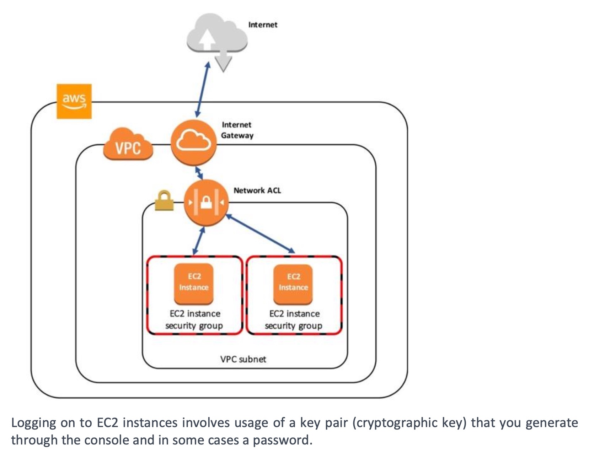
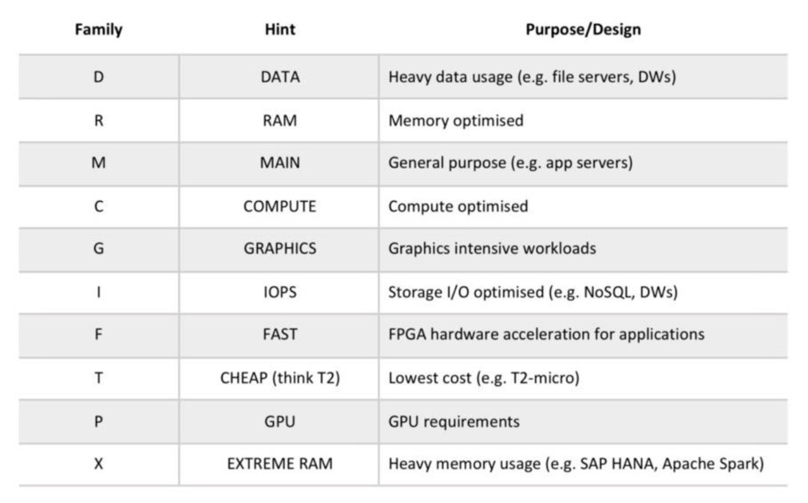
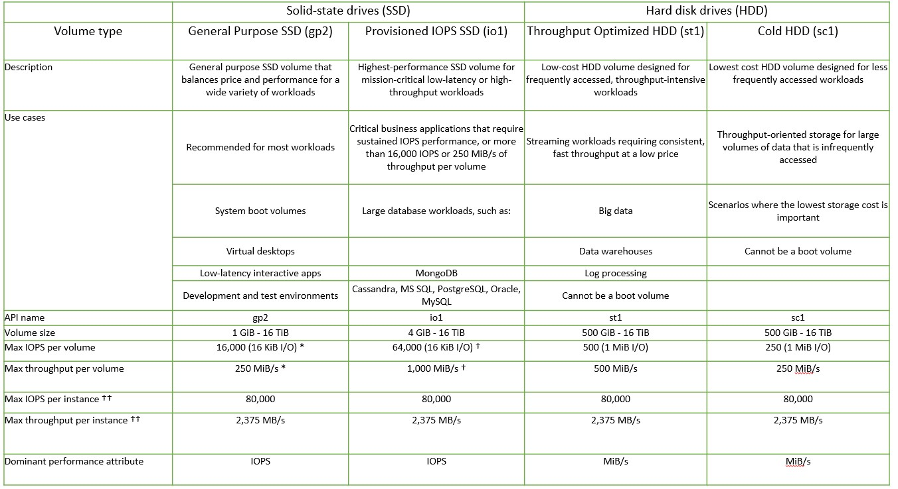

## AWS Definitions

### Hypervisor

When used in Cloud computing, the Operating system that is directly installed on top of the hardware is called - **Hypervisor**. It is on top of this Hypervisor that additional, multiple Operating Systems are installed as Virtual Machines (VMs)

- A VM is container within which virtualized resources are installed - vCPU, vRAM
- Example of Type 01 Hypervisor include - VMWare ESXi & Microsoft Hyper-V
- Example of Type 02 Hypervisor include - VMWare workstation & Oracle Virtual Box
- Until now, Amazon was using the Xen Hypervisor which is now transitioned to KVM (Kernel based Virtual Machine)

### Benefits of EC2

- Elastic Web-scale computing
- Inexpensive

:exclamation: :exclamation:The following table classifies AWS services based on their scope (Global or Regional Level)

| Global Scope / Service | Regional Scope / Service |
| ---------------------- | ------------------------ |
| AWS Route 53           | AWS EC2                  |
| AWS CloudFront         | AWS Lambda               |
| AWS IAM                | AWS S3                   |
| AWS STS                |                          |

> AWS S3 has global namespace, but buckets & objects are created on regional level
>
> By default all AWS STS requests go to the single endpoint: https://sts.amazonaws.com

### :exclamation: :exclamation: Free Services

Free services include:

- Amazon VPC.
- Elastic Beanstalk (but not the resources created).
- CloudFormation (but not the resources created).
- Identity Access Management (IAM).
- Auto Scaling (but not the resources created).
- OpsWorks.
- Consolidated Billing.

### AWS S3 One Zone IA

> REMEMBER - In-frequest access with LOW RESILIENCY

Amazon S3 storage class to use for storing copies of backup data. The storage provides **rapid access when needed but resiliency can be low.**

### AWS App Mesh

AWS App Mesh makes it easy to monitor and control microservices running on AWS. App Mesh standardizes how your microservices communicate, giving you end-to-end visibility, and helping to ensure high availability for your applications.

### AWS EC2 Launch Type

With the EC2 launch type, you can use Amazon ECS to manage a cluster of servers and schedule placement of containers on the servers.

#### _How it is different from Fargate ?_

With the Fargate launch type, all you have to do is package your application in containers, specify the CPU and memory requirements, define networking and IAM policies, and launch the application. EC2 launch type allows you to have server-level, more granular control over the infrastructure that runs your container applications. Thus, Fargate is an incorrect answer.

### AWS RDS on VMWare

Amazon Relational Database Service (RDS) on VMware lets you deploy managed databases in on-premises VMware environments using the Amazon RDS technology enjoyed by hundreds of thousands of AWS customers. RDS on VMware allows you to utilize the same simple interface for managing databases in on-premises VMware environments as you would use in AWS.

### AWS Polly

Amazon Polly is a service that turns text into lifelike speech. Polly lets you create applications that talk, enabling you to build entirely new categories of speech-enabled products. Polly is an Amazon artificial intelligence (AI) service that uses advanced deep learning technologies to synthesize speech that sounds like a human voice. Polly includes 47 lifelike voices spread across 24 languages, so you can select the ideal voice and build speech-enabled applications that work in many different countries.

### AWS Lifecycle Management

Amazon S3 service you can use to automatically migrate data from one storage class to another after a set number of days as a means of reducing your costs, especially where frequent instant access may not be required to that subset of data.

### AWS Outpost

With AWS Outposts you can run Amazon EC2, Amazon EBS, container-based services such as Amazon EKS, database services such as Amazon RDS on AWS Outposts and analytics services such as Amazon EMR on-premises. This enables you to extend your Amazon Virtual Private Cloud on-premises and run some AWS services locally on Outposts hosted on your own Datacentre.

| AWS Outpost                                                  | AWS Direct Connect                                           |
| ------------------------------------------------------------ | ------------------------------------------------------------ |
| With AWS Outposts you can run Amazon EC2, Amazon EBS, container-based services such as Amazon EKS, database services such as Amazon RDS on AWS Outposts and analytics services such as Amazon EMR on-premises. This enables you to extend your Amazon Virtual Private Cloud on-premises and run some AWS services locally on Outposts hosted on your own Datacentre. | ‘AWS Direct Connect’ is incorrect as although it enables you to connect your datacentre to your VPC in the cloud over AWS private links, you cannot use it to host EC2 or EBS services on-premise. |
| You can use AWS Outpost to host AWS EC2 instances            | You cannot use AWS Direct Connect to host instances          |
| On Instance Level                                            | On Subnet Level                                              |

### AWS OpsWorks

AWS OpsWorks supports continuous configuration through lifecycle events that automatically update your instances' configuration to adapt to environment changes

- Provides managed instances of Chef & Puppet
- Alows you to use code to automate the configuration of your servers
- Chef & Puppet allow you to define how the servers are configured, deployed & managed across your EC2 instances.

### ELB & Auto Scaling

AWS provides ELB & Auto-scaling to evenly distribute incoming connections and make sure the right amount of instances are available to service the load. It does this using Elastic Load Balancer & Auto-scaling

Elastic Load Balancer provides the following benefits -

- High Availability - Automatically distributes incoming traffic across multiple EC2 instances
- Security - Certificate management, SSL / TLS Encryption

EC2 Auto scaling complements the architecture by automatically DYNAMICALLY scaling the number of EC2 instances depending on the load

Auto scaling provides -

- Fault Tolerance - Auto scaling detects when an instance is unhealthy & replaces it
- Scalability & Elasticity

- :exclamation: When you create a load balancer, you must choose whether to make it an internal load balancer or an internet-facing load balancer. In a multi-tier architecture, as described above, you would deploy an internal load balancer to distribute traffic from the webservers to the application servers. The nodes of an internal load balancer have only private IP addresses. The DNS name of an internal load balancer is publicly resolvable to the private IP addresses of the nodes. Therefore, internal load balancers can only route requests from clients with access to the VPC for the load balancer.

- The answer “Internet-facing” is incorrect as this configuration is used to support traffic the web-servers from users on the Internet

### Security Groups

Security Groups are firewalls that protect the individual EC2 Instance and further restrict what traffic can be allowed to the instance.

### NACLs

NACLs are firewalls that protect the entire subnet and allow you to define both allow and deny rules for traffic that flows into and out of the subnet. This protects your EC2 Instance the Subnet.

### AWS WAF

AWS WAF is an incorrect answer. AWS WAF is a web application firewall that helps protect your web applications or APIs against common web exploits. 

- AWS WAF can be used to control how traffic reaches your applications by enabling you to create security rules that block common attack patterns, such as SQL injection or cross-site scripting, and rules that filter out specific traffic patterns you configure.

### EFS vs S3 vs EBS

| EFS                                                          | S3                                                           | EBS                                                          |
| ------------------------------------------------------------ | ------------------------------------------------------------ | ------------------------------------------------------------ |
| Shared File System                                           | S3 is Object Storage                                         | Elastic Block Storage                                        |
| :exclamation: Remember - One EFS can be used to support MANY EC2 instances. EFS is based on Network File System (Unix / Linux) | Provides a Flat hierarchy of storage. The topmost level containers are called Buckets. High scalability. Supports REST, SOAP & HTTP access. | EBS Volumes are durable, block-level storage volumes that can be attached to SINGLE EC2 instance only. |
| EFS is a Regional Service. Stores data across mulitple AZs   |                                                              | Used to take snapshots backup                                |
| Ideal for Hierarchical data ie., Folders, Files. Ideal to store documents, Audit, E-papers, DB Backups, shared corporate directories, content management | Used mainly for Web applications files / objects / images storage. Can also store files, images, video, audio | Ideal for DB, Disk Images, VMS.                              |
| It provides a simple interface allowing you to create and configure file systems quickly and manages the file storage infrastructure for you, removing the complexity of deploying, patching, and maintaining the underpinnings of a file system. | Ideally used to host assets such as documents, images, and videos which can be referenced by web applications. | Most EC2 instance types use EBS for persistent storage.      |
|                                                              | mainly for - Media hosting and Static website hosting        | a.k.a "Virtual Hard disk on cloud"                           |

### EBS Volume Types

- General Purpose SSD (gp2)
- Provisioned IOPS SSD (io1)
- Throughput optimized HDD (st1)
- Cold HDD (sc1)
- Magnetic (standard, a previous generation type)

### EKS

[More about EKS](https://aws.amazon.com/eks/features/)

Amazon Elastic Container Service for Kubernetes (EKS) is a managed service for you to run Kubernetes on AWS, without needing to install, operate or maintain your own Kubernetes control panel.

### IAM Policies vs Bucket Policies

[Distinction between IAM & S3 Bucket Policies](https://aws.amazon.com/blogs/security/iam-policies-and-bucket-policies-and-acls-oh-my-controlling-access-to-s3-resources/)

| IAM Policies                                                 | S3 Bucket Policies                                           |
| ------------------------------------------------------------ | ------------------------------------------------------------ |
| IAM policies specify what actions are allowed or denied on what AWS resources (e.g. allow ec2:TerminateInstance on the EC2 instance with instance_id=i-8b3620ec). You attach IAM policies to IAM users, groups, or roles, which are then subject to the permissions you’ve defined. | S3 bucket policies, on the other hand, are attached only to S3 buckets. S3 bucket policies specify what actions are allowed or denied for which principals on the bucket that the bucket policy is attached to (e.g. allow user Alice to PUT but not DELETE objects in the bucket). |
| AWS User account centric                                     | AWS S3 bucket centric                                        |
| What can this user do in AWS ?                               | Who can access this S3 bucket ?                              |

Use IAM policies if:

- You need to control access to AWS services other than S3. IAM policies will be easier to manage since you can centrally manage all of your permissions in IAM, instead of spreading them between IAM and S3.
-  You have numerous S3 buckets each with different permissions requirements. IAM policies will be easier to manage since you don’t have to define a large number of S3 bucket policies and can instead rely on fewer, more detailed IAM policies.
- You prefer to keep access control policies in the IAM environment.

Use S3 bucket policies if:

- You want a simple way to grant [cross-account access](http://docs.aws.amazon.com/AmazonS3/latest/dev/AccessPolicyLanguage_UseCases_s3_a.html) to your S3 environment, without using [IAM roles](http://docs.aws.amazon.com/IAM/latest/UserGuide/cross-acct-access-walkthrough.html).
- Your IAM policies bump up against the size limit (up to 2 kb for users, 5 kb for groups, and 10 kb for roles). S3 supports bucket policies of up 20 kb.
- You prefer to keep access control policies in the S3 environment.

If you’re still unsure of which to use, consider which audit question is most important to you:

- If you’re more interested in “**What can this user do in AWS?**” then IAM policies are probably the way to go. You can easily answer this by looking up an IAM user and then examining their IAM policies to see what rights they have.
- If you’re more interested in “**Who can access this S3 bucket?**” then S3 bucket policies will likely suit you better. You can easily answer this by looking up a bucket and examining the bucket policy.

### AWS Transit Gateway

> :exclamation: Remember Hub & Spoke configuration

AWS Transit Gateway is a service that enables customers to connect their Amazon Virtual Private Clouds (VPCs) and their on-premises networks to a single gateway. This allows you to connect your on-premise network and all your VPCs in a hub and spoke configuration which significantly simplifies management and reduces operational costs because each network only has to connect to the Transit Gateway and not to every other network.

> :question:Which AWS service enables you to connect multiple VPCs configured as a hub that controls how traffic is routed among all the connected networks which act like spokes?
>
> Answer: AWS Transit Gateway

### AWS Global Accelerator

> High Availability, Low Latency

AWS Global Accelerator is a service that improves the availability and performance of your applications with local or global users. 

- It provides static IP addresses that act as a fixed entry point to your application endpoints in a single or multiple AWS Regions, such as your Application Load Balancers, Network Load Balancers, or Amazon EC2 instances.

### AWS VPC Peering

VPC Peering allows you to connect 2 peer-peer VPCs together

- It does not enalbe you to centrally manage multiple VPCs connections centrally.

### AWS Virtual Private Gateway

Component of your site-to-site VPN connection that needs to configured to build out a VPC tunnel with your on-premise network.

### AWS X-Ray

> Remember microservice architecture - enable developers to debug & analyze production distributed applications

AWS X-Ray helps developers analyze & debug production, distributed applications, especially those build using a microserice architecture

- With X-Ray, you can understand how your application & its underlying services are performing.
- To identify & troubleshoot the root cause of performance issues & errors.

### AWS CloudTrail

> Remember - Auditing across your AWS infrastructure

### AWS Well Architected Tool

The AWS Well-Architected Tool helps you review the state of your workloads and compares them to the latest AWS architectural best practices. The tool is based on the AWS Well-Architected Framework, developed to help cloud architects build secure, high-performing, resilient, and efficient application infrastructure.

> [Link to Well Architected Framework - Miro](https://miro.com/app/board/o9J_ldQI6vc=/)

### AWS Trusted Advisor

Provides real-time guidance following AWS best practices.

- 7 AWS Trusted advisor checks for Basic & Developer billing model
- All AWS Trusted advisor checks for Business & Enterprise billing model

### AWS Kinesis Firehose

> Remember Video streaming integration with S3, Redshift, Elastic-search

Amazon Kinesis Data Firehose provides a simple way to capture, transform, and load streaming data with just a few clicks in the AWS Management Console. 

- It is integrated with Amazon S3, Amazon Redshift, and Amazon Elasticsearch Service and you can capture, transform, and load streaming data. 

- From the AWS Management Console, you can point Kinesis Data Firehose to an Amazon S3 bucket, Amazon Redshift table, or Amazon Elasticsearch domain.

  

### AWS Kinesis Video Streams

> Remember Video streaming for analysis

Amazon Kinesis Video Streams makes it easy to securely stream video from connected devices to AWS for analytics, machine learning (ML), playback, and other processing. Kinesis Video Streams automatically provisions and elastically scales all the infrastructure needed to ingest streaming video data from millions of devices.

### AWS Athena

> Analyse S3 data using interactive SQL queries. Also serverless.

Amazon Athena is an interactive query service that makes it easy to analyze data in Amazon S3 using standard SQL. Athena is serverless, so there is no infrastructure to manage, and you pay only for the queries that you run.

### NAT Gateway

‘NAT Gateway’,  is used to enable Internet access for servers deployed in the private subnet

### Amazon Macie

> :exclamation:Remember MACIE is present in MACHINE LEARNING

- Amazon Macie is a security service that uses machine learning to automatically discover, classify, and protect sensitive data in AWS. 
- Amazon Macie recognizes sensitive data such as personally identifiable information (PII) or intellectual property (such as your corporate application source codes) and provides you with dashboards and alerts that give visibility into how this data is being accessed or moved. 
- The fully managed service continuously monitors data access activity for anomalies and generates detailed alerts when it detects the risk of unauthorized access or inadvertent data leaks. 
- Amazon Macie is available to protect data stored in Amazon S3.

### Amazon Guard Duty

AWS security service offer threat detection capabilities using machine learning and behavior models to help detect such malicious activity

### Amazon Glacier

> [About Amazon S3 Glacier](https://aws.amazon.com/glacier/)
>
> Amazon S3 storage classes should be used for storing data for long time periods when immediate access is not required at the LOWEST cost

**Amazon S3 Glacier** and **S3 Glacier Deep Archive** are a secure, durable, and extremely low-cost Amazon S3 cloud storage classes for data archiving and long-term backup. They are designed to deliver 99.999999999% durability, and provide comprehensive security and compliance capabilities that can help meet even the most stringent regulatory requirements. 

- Customers can store data for as little as $1 per terabyte per month, a significant savings compared to on-premises solutions. 
- To keep costs low yet suitable for varying retrieval needs, Amazon S3 Glacier provides three options for access to archives, from a few minutes to several hours, and S3 Glacier Deep Archive provides two access options ranging from 12 to 48 hours.
-  Expedited retrievals typically return data in 1-5 minutes, and are great for [Active Archive](https://aws.amazon.com/archive/) use cases.
- Standard retrievals typically complete between 3-5 hours, and work well for less time-sensitive needs like backup data, media editing, or long-term analytics. 
- Bulk retrievals are the lowest-cost retrieval option, returning large amounts of data within 5-12 hours. The Amazon S3 Glacier Deep Archive storage class provides two retrieval options ranging from 12-48 hours.

### Amazon S3 Intelligent Tiering

The S3 Intelligent-Tiering storage class is designed to optimize costs by automatically moving data to the most cost-effective access tier, without performance impact or operational overhead. It works by storing objects in two access tiers: one tier that is optimized for frequent access and another lower-cost tier that is optimized for infrequent access. For a small monthly monitoring and automation fee per object, Amazon S3 monitors access patterns of the objects in S3 Intelligent-Tiering and moves the ones that have not been accessed for 30 consecutive days to the infrequent access tier. If an object in the infrequent access tier is accessed, it is automatically moved back to the frequent access tier.

>  The answer “Amazon Glacier” is incorrect as while it is the cheapest available on the platform, it does not offer the ability to make data instantly available when required. Retrieving data from Glacier can take a bit of time depending on the retrieval option.

### Amazon Snowball

> [About Amazon Snowball](https://aws.amazon.com/snowball/?whats-new-cards.sort-by=item.additionalFields.postDateTime&whats-new-cards.sort-order=desc)

Snowball moves terabytes of data in about a week. You can use it to move things like databases, backups, archives, healthcare records, analytics datasets, IoT sensor data and media content, especially when network conditions prevent realistic timelines for transferring large amounts of data both into and out of AWS.

With Amazon Snowball, you can transfer 100s of Terabytes or Petabytes of data between your on-premise data centres & Amazon Simple Storage Service (S3).

- Snowball can import to S3 or export from S3
- Snowball - 80TB (upto 50TB allowed in the USA)
- Snowball Edge - 100TB comes with onboard storage & compute capabilities
- Snowball supports specific Amazon EC2 instance types and AWS Lambda functions, so you can develop and test in the AWS Cloud, then deploy applications on devices in remote locations to collect, pre-process, and ship the data to AWS. 
- Common use cases include data migration, data transport, image collation, IoT sensor stream capture, and machine learning.

### AWS Batch

>  [More about AWS Batch](https://aws.amazon.com/batch/features/)

With AWS Batch, you can simply - package the code for you batch jobs, specify their dependencies & submit your batch jobs to AWS management console, CLI or SDK.

- Batch jobs allow you to execution parameters & job dependencies & facilitate integrations
- Eg: Pegasus, WMS, Luigi, AWS Step functions
- AWS Batch jobs can efficiently scale your EC2 & Spot instances based on the requirements of your jobs.

### AWS Storage Gateway

AWS Storage gateway is a Hybrid cloud storage which makes it easier for you to connect your On-Premise environment with AWS cloud.

- AWS Storage Gateway seamlessly connects your local production or backup applications with NFS, SMB, iSCSI, or iSCSI-VTL

### CloudWatch

>  Cloud watch is for performance monitoring & Log retention

Cloudwatch can monitor the following resources

- Amazon DynamoDB tables
- Amazon RDS DB instances
- EC2 instances
- Custom metrics developed by your application & servers
- Custom logs by your application

### :exclamation: CloudWatch Retention Information

Cloudwatch retains metric data as follows:

- Data points with a period < 60 seconds are available for a period of 3 hours. High res custom metrics
- Data points with a period of 60 seconds (1 min) are available for a period of 15 days
- Data points with a period of 300 seconds (15 mins) are available for period of 63 days
- Data points with a period of 36000 seconds (1 hour) are available for period of 455 days (15 months)

### :exclamation:Cloudwatch Monitoring

- **Basic Monitoring** - 5 mins (free for EC2, ELBs, EBS & RDS DBs)
- **Detailed Monitoring** - 1 min (Chargeable)

### CloudMap

AWS service allows you to register any application resources, such as databases, queues, microservices, and other cloud resources, with custom names, that allows your applications to easily query the registry for the location of such resources

### CloudTrail

Is used for auditing purposes and logs activities between your AWS resources

- delivers log files to Amazon S3 Bucket
- saves history of AWS API Calls
- Visibility of user acitivity by logging actions taken on your AWS account
- Not enabled by default

### AWS SNS - Simple Notification Service

AWS webservice which makes it easier to setup, operate & send notifications from the cloud. Can send manual or automated messages to Email, Mobile, SQS & HTTP endpoints.

- Message Data types are JSON data types. Messages are string based formatted only

### AWS SWF - Simple Workflow Service

Amazon SWF helps developers build, run & scale background jobs that have parallel or sequential steps.

### AWS SQS - Simple Queue Service

Fully managed Message Queueing Service that enables you to decouple & scale Microservices, Distributed systems & Serverless Applications.

### AWS SES - Simple Email Service

Cloud-based email service which helps digital marketers & application developers send marketing notifications & transactional messages

- Message can be HTML based rich test formatted.

### AWS QuickStarts

Quick starts are built by AWS arhitects & partners to help you deploy popular solutions on AWS, based on AWS best practices for security & high availabililty

- Implement key technologies automatically
- Single click, less than an hour
- Leverages Cloud Formation (remember Infrastructure as Code)

### AWS KMS - Key Management Service

> Key Encryption on AWS Service level

AWS KMS gives you centralized control over encryption of keys used to protect your data

- Import, Rotate, Disable, Enable, Apply usage policies & Audit

- Integrated with other AWS Services

- Also integrated with CloudTrail

- 1 click encryption using AWS console or by using AWS SDK

  

### AWS HSM - Hardware Security Model

> User defined Key encryptionn on Application level

Cloud based Hardware security model that lets you define your own keys and use them in your application

- Manage your own keys using FIPS 140-2 Level 3
- Use industry standard APIs - PKCS#11, Java cryptography extension (JCE), Microsoft CyptoNG libraries (CNG)

- Uses an agent installed on EC2 instances
- EC2 instances must be tagged

### AWS Elasitcache - ES

Amazon ES offers **Redis** & **Memcached**.

- Seamlessly deploy,  run & operate open-source in-memory compatible data-sources
- Amazon elasticache can significantly improve latency & throughput of read-heavy applications such as Social Networking, Games, Media Sharing & Q&A Portals

### AWS Neptune

> REMEMBER: Sophisticated, interactive Graph application + Query billions of data in seconds

With AWS Neptune, you can create sophisticated, interactive graph applications which can query billions of data in seconds.

- SQL Queries for Highly-connected datasets is difficult to tune for performance
- Amazon Neptune allows you to use Graph query languages - TinkerPop Gremlin & W3C's SPARQL

### AWS Redshift

> REMEMBER, Fully managed data warehouse solution + BI Tools + Analyze data

Amazon Redshift is a fast, fully managed data warehouse that makes it simple and cost-effective to analyze all your data using standard SQL and your existing Business Intelligence (BI) tools. 

- It allows you to run complex analytic queries against petabytes of structured data using sophisticated query optimization, columnar storage on high-performance storage, and massively parallel query execution.

### AWS SMS - Server Migration Service

AWS SMS is an agentless service which makes it easier and faster for you to migrate _thousands_ of On-Premise workloads to AWS cloud.

### AWS - Database Migration Service 

The AWS Database Migration Service can migrate your data to and from the most widely used commercial and open-source databases. The service supports homogeneous migrations such as Oracle to Oracle, as well as heterogeneous migrations between different database platforms, such as Oracle to Amazon Aurora or Microsoft SQL Server to MySQL.

> Perform heterogeneous migrations between different database platforms, such as Oracle to Amazon Aurora

### AWS Parameter Store

> Remember - Heroku Environment Variables set like UI

AWS Parameter Store helps you to store your application environment variables in a secure encrypted manner

### AWS CodeStar

> [More about AWS CodeStar](https://aws.amazon.com/codestar/features/)

- AWS codestar allows you to quickly develop, build & deploy applications to AWS Cloud
- Has many project templates which you can use to configure AWS Lambda, Elastic Beanstalk and Amazon EC2 instances
- Support Java, Javascript, PHP, Ruby & Python

### Elastic Transcoder

AWS service which can be used to convert video and audio files from their source format into versions that will playback on devices like smartphones, tablets and PC

### Amazon EMR

**Amazon EMR** is the industry-leading cloud big data platform for processing vast amounts of data using open source tools such as Apache Spark, Apache Hive, Apache HBase, Apache Flink, Apache Hudi, and Presto.

