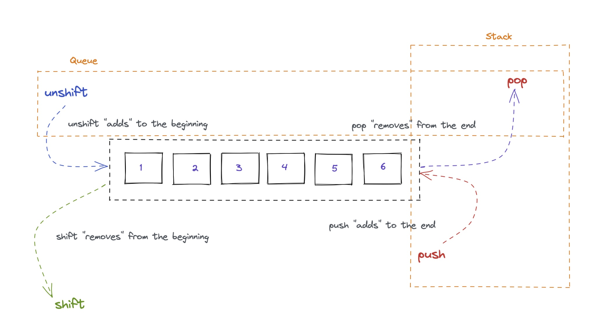

# Stacks



 A stack is a collection of items that obeys the principle of **"last in, first out"**. Like a stack of plates, we can only access the topmost plate at any time. We must remove that plate before we get down to other plates. This is useful for function calls, hence why it's called a **"call stack"** in JavaScript.

## Dealing with Array

| Beginning of the Array                 | End of the Array               |
| -------------------------------------- | ------------------------------ |
| **unshift** - Adds to the beginning    | **push** - Adds to the end     |
| **shift** - Removes from the beginning | **pop** - Removes from the end |

When we place a new item onto the stack, we have to remove it first before we get to any other item in the stack that's there before. This data structure is used for handling things like nested function calls in JavaScript. Hence, why it's called a call **stack**.

Our stack will have several methods and properties, `push`, `pop`, `peek`, to look at what's next to be removed, `length`, and `isEmpty`. We'll start by creating an array held in closure to store our items.


```javascript
function createStack() {
  const arr = [];
  return {
    // add or push
    push(item) {
      arr.push(item);
    },
    // remove or dequeue
    pop() {
      return arr.pop();
    },
    // peek
    peek() {
      return arr[arr.length-1];
    },
    // length
    get length() {
      return arr.length;
    },
    // check if empty
    isEmpty() {
      return arr.length === 0;
    }
  };
}

const stack = createStack();
stack.push('Put on my pants');
stack.push('Put Socks');
stack.push('First: Put on shirt');
stack.push('Put shoes');

console.log(stack.pop());
console.log(stack.pop());
console.log(stack.pop());
console.log(stack.pop());
console.log(stack.isEmpty());

// Put shoes
// First: Put on shirt
// Put Socks
Put on my pants
true
```

